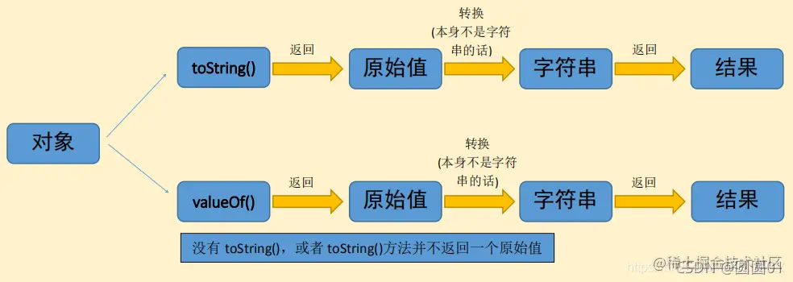

# JS原始类型转换的抽象操作toPrimitive

当一个对象转换为原始类型时会调用该函数，该函数被调用时，会被传递一个字符串参数**hint**，表示要转换到的原始值的预期类型。参数的取值是 "**number**"、"**string**" 和 "**default**" 中的任意一个。

toPrimitive转换规则如下：
> 如果传入参数是*string*，也就是对象到字符串的转换
> - 如果对象中有toString()方法，则调用这个方法。如果它返回一个原始值(undefined、Boolean、Number、String、BigInt、Symbol 和 null)，js将这个值转换为字符串(如果本身不是字符串的话)，并返回这个字符串结果。
> - 如果对象没有toString()方法，或者toString()没有返回一个原始值，那么js会调用valueOf()方法。如果返回值是原始值，js将这个值转换为字符串，并返回字符串结果。
> - 否则，js抛出一个类型错误异常。
>
> 

> 如果传入参数是*number/default*，也就是对象到数字的转换
> 和上面有点不同，到数字的转换会先尝试使用valueOf()方法
> - 如果对象具有valueOf()方法，后者返回一个原始值，则js会将其转换为数字(如果需要的话)并返回这个数字。
> - 否则，如果对象具有toString()方法，返回一个原始值(字符串直接量)，则js将其转换为数字类型，并返回这个数字。
> - 否则，js抛出一个类型错误异常。
> **对于所有非日期对象来说，对象到原始值的转换基本上是对象到数字的转换**
