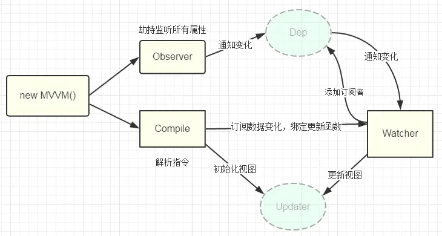
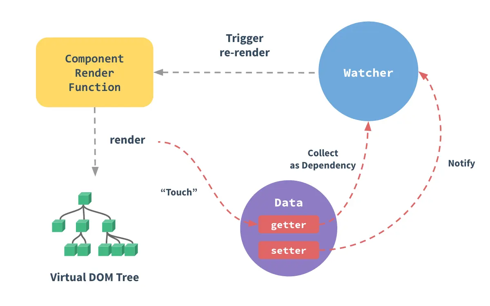
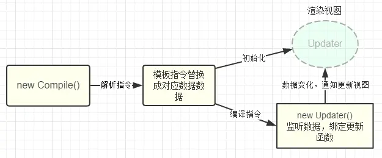

# Vue2.0双向绑定原理
vue采用**数据劫持结合发布者-订阅者模式**的方式，通过Object.defineProperty()来劫持各个属性的setter，getter，在数据变动时发布消息给订阅者，触发相应的监听回调。

**整体思路**
**核心：**通过Object.defineProperty()来实现对属性的劫持，达到监听数据变动的目的
**要实现mvvm的双向绑定，就必须要实现以下几点：**

1. 实现一个数据监听器Observer，能够对数据对象的所有属性进行监听，如有变动可拿到最新值并通知订阅者
2. 实现一个指令解析器Compile，对每个元素节点的指令进行扫描和解析，根据指令模板替换数据，以及绑定相应的更新函数
3. 实现一个Watcher，作为连接Observer和Compile的桥梁，能够订阅并收到每个属性变动的通知，执行指令绑定的相应回调函数，从而更新视图
4. mvvm入口函数，整合以上三者



## 如何实现Observer追踪变化
> 当你把一个普通的 JavaScript 对象传入 Vue 实例作为 data 选项，Vue 将遍历此对象所有的属性，并使用 Object.defineProperty 把这些属性全部转为 getter/setter。Object.defineProperty 是 ES5 中一个无法 shim 的特性，这也就是 Vue 不支持 IE8 以及更低版本浏览器的原因。
> 这些 getter/setter 对用户来说是不可见的，但是在内部它们让 Vue 能够追踪依赖，在属性被访问和修改时通知变更。这里需要注意的是不同浏览器在控制台打印数据对象时对 getter/setter 的格式化并不同，所以建议安装 vue-devtools 来获取对检查数据更加友好的用户界面。
> 每个组件实例都对应一个 watcher 实例，它会在组件渲染的过程中把“接触”过的数据属性记录为依赖。之后当依赖项的 setter 触发时，会通知 watcher，从而使它关联的组件重新渲染。
> 


相关代码如下：
```
var data = {name: 'kindeng'};
observe(data);
data.name = 'dmq'; // 哈哈哈，监听到值变化了 kindeng --> dmq

function observe(data) {
    if (!data || typeof data !== 'object') {
        return;
    }
    // 取出所有属性遍历
    Object.keys(data).forEach(function(key) {
        defineReactive(data, key, data[key]);
    });
};

function defineReactive(data, key, val) {
    observe(val); // 监听子属性
    Object.defineProperty(data, key, {
        enumerable: true, // 可枚举
        configurable: false, // 不能再define
        get: function() {
            return val;
        },
        set: function(newVal) {
            console.log('哈哈哈，监听到值变化了 ', val, ' --> ', newVal);
            val = newVal;
        }
    });
}
```
这样我们已经可以监听每个数据的变化了，那么监听到变化之后就是怎么通知订阅者了，所以接下来我们需要实现一个消息订阅器，很简单，维护一个数组，用来收集订阅者，数据变动触发notify，再调用订阅者的update方法，代码改善之后是这样：
```
// ... 省略
function defineReactive(data, key, val) {
    var dep = new Dep();
    observe(val); // 监听子属性

    Object.defineProperty(data, key, {
        // ... 省略
        set: function(newVal) {
            if (val === newVal) return;
            console.log('哈哈哈，监听到值变化了 ', val, ' --> ', newVal);
            val = newVal;
            dep.notify(); // 通知所有订阅者
        }
    });
}

function Dep() {
    this.subs = [];
}
Dep.prototype = {
    addSub: function(sub) {
        this.subs.push(sub);
    },
    notify: function() {
        this.subs.forEach(function(sub) {
            sub.update();
        });
    }
};
```
那么问题来了，谁是订阅者？怎么往订阅器添加订阅者？ 没错，上面的思路整理中我们已经明确订阅者应该是Watcher, 而且var dep = new Dep();是在 defineReactive方法内部定义的，所以想通过dep添加订阅者，就必须要在闭包内操作，所以我们可以在 getter里面动手脚：
```
// Observer.js
// ...省略
Object.defineProperty(data, key, {
    get: function() {
        // 由于需要在闭包内添加watcher，所以通过Dep定义一个全局target属性，暂存watcher, 添加完移除
        Dep.target && dep.addDep(Dep.target);
        return val;
    }
    // ... 省略
});

// Watcher.js
Watcher.prototype = {
    get: function(key) {
        Dep.target = this;
        this.value = data[key]; // 这里会触发属性的getter，从而添加订阅者
        Dep.target = null;
    }
}
```
这里已经实现了一个Observer了，已经具备了监听数据和数据变化通知订阅者的功能,完整代码见demo

## 如何实现compile
compile主要做的事情是解析模板指令，将模板中的变量替换成数据，然后初始化渲染页面视图，并将每个指令对应的节点绑定更新函数，添加监听数据的订阅者，一旦数据有变动，收到通知，更新视图，如图所示：


因为遍历解析的过程有多次操作dom节点，为提高性能和效率，会先将vue实例根节点的el转换成文档碎片fragment进行解析编译操作，解析完成，再将fragment添加回原来的真实dom节点中
```
function Compile(el) {
    this.$el = this.isElementNode(el) ? el : document.querySelector(el);
    if (this.$el) {
        this.$fragment = this.node2Fragment(this.$el);
        this.init();
        this.$el.appendChild(this.$fragment);
    }
}
Compile.prototype = {
    init: function() { this.compileElement(this.$fragment); },
    node2Fragment: function(el) {
        var fragment = document.createDocumentFragment(), child;
        // 将原生节点拷贝到fragment
        while (child = el.firstChild) {
            fragment.appendChild(child);
        }
        return fragment;
    }
};
```
compileElement方法将遍历所有节点及其子节点，进行扫描解析编译，调用对应的指令渲染函数进行数据渲染，并调用对应的指令更新函数进行绑定，详看代码及注释说明：
```
Compile.prototype = {
    // ... 省略
    compileElement: function(el) {
        var childNodes = el.childNodes, me = this;
        [].slice.call(childNodes).forEach(function(node) {
            var text = node.textContent;
            var reg = /\{\{(.*)\}\}/;   // 表达式文本
            // 按元素节点方式编译
            if (me.isElementNode(node)) {
                me.compile(node);
            } else if (me.isTextNode(node) && reg.test(text)) {
                me.compileText(node, RegExp.$1);
            }
            // 遍历编译子节点
            if (node.childNodes && node.childNodes.length) {
                me.compileElement(node);
            }
        });
    },

    compile: function(node) {
        var nodeAttrs = node.attributes, me = this;
        [].slice.call(nodeAttrs).forEach(function(attr) {
            // 规定：指令以 v-xxx 命名
            // 如 <span v-text="content"></span> 中指令为 v-text
            var attrName = attr.name;   // v-text
            if (me.isDirective(attrName)) {
                var exp = attr.value; // content
                var dir = attrName.substring(2);    // text
                if (me.isEventDirective(dir)) {
                    // 事件指令, 如 v-on:click
                    compileUtil.eventHandler(node, me.$vm, exp, dir);
                } else {
                    // 普通指令
                    compileUtil[dir] && compileUtil[dir](node, me.$vm, exp);
                }
            }
        });
    }
};

// 指令处理集合
var compileUtil = {
    text: function(node, vm, exp) {
        this.bind(node, vm, exp, 'text');
    },
    // ...省略
    bind: function(node, vm, exp, dir) {
        var updaterFn = updater[dir + 'Updater'];
        // 第一次初始化视图
        updaterFn && updaterFn(node, vm[exp]);
        // 实例化订阅者，此操作会在对应的属性消息订阅器中添加了该订阅者watcher
        new Watcher(vm, exp, function(value, oldValue) {
            // 一旦属性值有变化，会收到通知执行此更新函数，更新视图
            updaterFn && updaterFn(node, value, oldValue);
        });
    }
};

// 更新函数
var updater = {
    textUpdater: function(node, value) {
        node.textContent = typeof value == 'undefined' ? '' : value;
    }
    // ...省略
};
```
这里通过递归遍历保证了每个节点及子节点都会解析编译到，包括了{{}}表达式声明的文本节点。指令的声明规定是通过特定前缀的节点属性来标记，如<span v-text="content" other-attr中v-text便是指令，而other-attr不是指令，只是普通的属性。 监听数据、绑定更新函数的处理是在compileUtil.bind()这个方法中，通过new Watcher()添加回调来接收数据变化的通知

## 实现Watcher
Watcher订阅者作为Observer和Compile之间通信的桥梁，主要做的事情是: 1、在自身实例化时往属性订阅器(dep)里面添加自己 2、自身必须有一个update()方法 3、待属性变动dep.notice()通知时，能调用自身的update()方法，并触发Compile中绑定的回调，则功成身退。
```
function Watcher(vm, exp, cb) {
    this.cb = cb;
    this.vm = vm;
    this.exp = exp;
    // 此处为了触发属性的getter，从而在dep添加自己，结合Observer更易理解
    this.value = this.get(); 
}
Watcher.prototype = {
    update: function() {
        this.run(); // 属性值变化收到通知
    },
    run: function() {
        var value = this.get(); // 取到最新值
        var oldVal = this.value;
        if (value !== oldVal) {
            this.value = value;
            this.cb.call(this.vm, value, oldVal); // 执行Compile中绑定的回调，更新视图
        }
    },
    get: function() {
        Dep.target = this;  // 将当前订阅者指向自己
        var value = this.vm[exp];   // 触发getter，添加自己到属性订阅器中
        Dep.target = null;  // 添加完毕，重置
        return value;
    }
};
// 这里再次列出Observer和Dep，方便理解
Object.defineProperty(data, key, {
    get: function() {
        // 由于需要在闭包内添加watcher，所以可以在Dep定义一个全局target属性，暂存watcher, 添加完移除
        Dep.target && dep.addDep(Dep.target);
        return val;
    }
    // ... 省略
});
Dep.prototype = {
    notify: function() {
        this.subs.forEach(function(sub) {
            sub.update(); // 调用订阅者的update方法，通知变化
        });
    }
};
```
实例化Watcher的时候，调用get()方法，通过Dep.target = watcherInstance标记订阅者是当前watcher实例，强行触发属性定义的getter方法，getter方法执行的时候，就会在属性的订阅器dep添加当前watcher实例，从而在属性值有变化的时候，watcherInstance就能收到更新通知。

## 实现MVVM
MVVM作为数据绑定的入口，整合Observer、Compile和Watcher三者，通过Observer来监听自己的model数据变化，通过Compile来解析编译模板指令，最终利用Watcher搭起Observer和Compile之间的通信桥梁，达到数据变化 -> 视图更新；视图交互变化(input) -> 数据model变更的双向绑定效果。

```
function MVVM(options) {
    this.$options = options;
    var data = this._data = this.$options.data;
    observe(data, this);
    this.$compile = new Compile(options.el || document.body, this)
}
```
但是这里有个问题，从代码中可看出监听的数据对象是options.data，每次需要更新视图，则必须通过var vm = new MVVM({data:{name: 'kindeng'}}); vm._data.name = 'dmq'; 这样的方式来改变数据。

显然不符合我们一开始的期望，我们所期望的调用方式应该是这样的： var vm = new MVVM({data: {name: 'kindeng'}}); vm.name = 'dmq';

所以这里需要给MVVM实例添加一个属性代理的方法，使访问vm的属性代理为访问vm._data的属性，改造后的代码如下：
```
function MVVM(options) {
    this.$options = options;
    var data = this._data = this.$options.data, me = this;
    // 属性代理，实现 vm.xxx -> vm._data.xxx
    Object.keys(data).forEach(function(key) {
        me._proxy(key);
    });
    observe(data, this);
    this.$compile = new Compile(options.el || document.body, this)
}

MVVM.prototype = {
    _proxy: function(key) {
        var me = this;
        Object.defineProperty(me, key, {
            configurable: false,
            enumerable: true,
            get: function proxyGetter() {
                return me._data[key];
            },
            set: function proxySetter(newVal) {
                me._data[key] = newVal;
            }
        });
    }
};
```
这里主要还是利用了Object.defineProperty()这个方法来劫持了vm实例对象的属性的读写权，使读写vm实例的属性转成读写了vm._data的属性值，达到鱼目混珠的效果


# Vue3.0双向绑定的原理
Vue3 将使用 ES6的Proxy 作为其观察者机制，取代之前使用的Object.defineProperty。

> 使用Object.defineProperty的局限性
> 在Vue中，Object.defineProperty无法监控到数组下标的变化，导致直接通过数组的下标给数组设置值，不能实时响应。 为了解决这个问题，经过vue内部处理后可以使用以下几种方法来监听数组
> ```
> push()
> pop() 
> shift()
> unshift()
> splice()
> sort()
> reverse()
> ```

> Object.defineProperty只能劫持对象的属性,因此我们需要对每个对象的每个属性进行遍历。Vue里，是通过递归以及遍历data对象来实现对数据的监控的，如果属性值也是对象那么需要深度遍历,显然如果能劫持一个完整的对象，不管是对操作性还是性能都会有一个很大的提升。


## 什么是Proxy
Proxy 是ES6中新增的一个特性，可以理解成，在目标对象之前架设一层“拦截”，外界对该对象的访问，都必须先通过这层拦截，因此提供了一种机制，可以对外界的访问进行过滤和改写。Proxy 这个词的原意是代理，用在这里表示由它来“代理”某些操作，可以译为“代理器”。

基础用法
```
var proxy = new Proxy(target, handler);
//ES6 原生提供 Proxy 构造函数，用来生成 Proxy 实例。
```
**参数解释**
1. target：是Proxy包装的被代理对象（可以是任何类型的对象，包括原生数组，函数，甚至另一个代理）
2. handler：是一个对象，其声明了代理target 的一些操作，其属性是当执行一个操作时定义代理的行为的函数
Proxy对象的所有用法，都是上面的形式，只是handler参数的写法不同

Proxy 一共 支持13 种的拦截,相对Object.defineProperty更加丰富。

- **get(target, propKey, receiver)**：拦截对象属性的读取，比如proxy.foo和proxy['foo']。
- **set(target, propKey, value, receiver)**：拦截对象属性的设置，比如proxy.foo = v或proxy['foo'] = v，返回一个布尔值。
- **has(target, propKey)**：拦截propKey in proxy的操作，返回一个布尔值。
- **deleteProperty(target, propKey)**：拦截delete proxy[propKey]的操作，返回一个布尔值。
- **ownKeys(target)**：拦截Object.getOwnPropertyNames(proxy)、Object.getOwnPropertySymbols(proxy)、Object.keys(proxy)、for...in循环，返回一个数组。该方法返回目标对象所有自身的属性的属性名，而Object.keys()的返回结果仅包括目标对象自身的可遍历属性。
- **getOwnPropertyDescriptor(target, propKey)**：拦截Object.getOwnPropertyDescriptor(proxy, propKey)，返回属性的描述对象。
- **defineProperty(target, propKey, propDesc)**：拦截Object.defineProperty(proxy, propKey, propDesc）、Object.defineProperties(proxy, propDescs)，返回一个布尔值。
- **preventExtensions(target)**：拦截Object.preventExtensions(proxy)，返回一个布尔值。
- **getPrototypeOf(target)**：拦截Object.getPrototypeOf(proxy)，返回一个对象。
- **isExtensible(target)**：拦截Object.isExtensible(proxy)，返回一个布尔值。
- **setPrototypeOf(target, proto)**：拦截Object.setPrototypeOf(proxy, proto)，返回一个布尔值。如果目标对象是函数，那么还有两种额外操作可以拦截。
- **apply(target, object, args)**：拦截 Proxy 实例作为函数调用的操作，比如proxy(...args)、proxy.call(object, ...args)、proxy.apply(...)。
- **construct(target, args)**：拦截 Proxy 实例作为构造函数调用的操作，比如new proxy(...args)。

proxy的使用案例见***demo1***