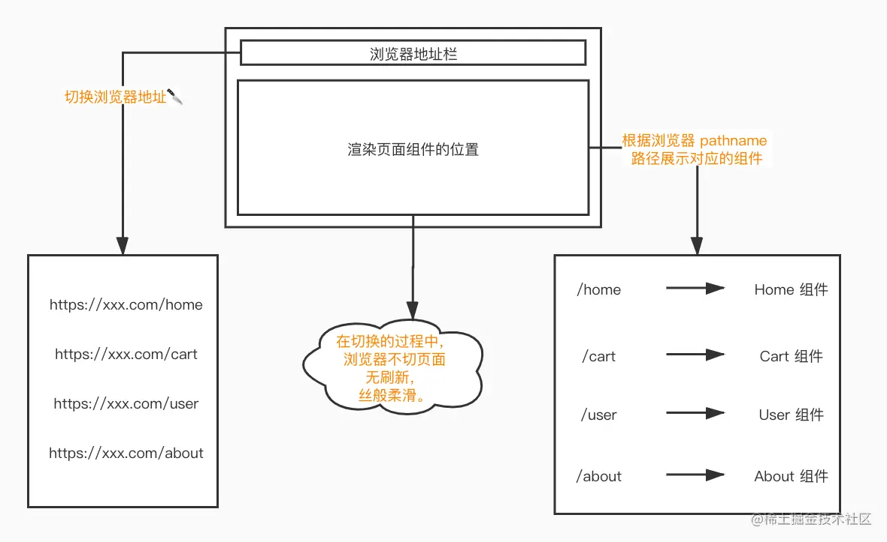

# 传统页面
这里不纠结叫法，凡是整个项目都是 DOM 直出的页面，我们都称它为“传统页面”（SSR 属于首屏直出，这里我不认为是传统页面的范畴）。那么什么是 DOM 直出呢？简单说就是在浏览器输入网址后发起请求，返回来的 HTML 页面是最终呈现的效果，那就是 DOM 直出。并且每次点击页面跳转，都会重新请求 HTML 资源

# 单页面
时代在进步，科技在发展，面对日益增长的网页需求，网页开始走向模块化、组件化的道路。随之而来的是代码的难以维护、不可控、迭代艰难等现象。面临这种情况，催生出不少优秀的现代前端框架，首当其冲的便是 React 、 Vue 、 Angular 等著名单页面应用框架。而这些框架有一个共同的特点，便是“通过 JS 渲染页面”。

既然单页面是这样渲染的，那如果我有十几个页面要互相跳转切换，咋整！！？？这时候 前端路由 应运而生，它的出现就是为了解决单页面网站，通过切换浏览器地址路径，来匹配相对应的页面组件。

**前端路由** 会根据浏览器地址栏 pathname 的变化，去匹配相应的页面组件。然后将其通过创建 DOM 节点的形式，塞入根节点 

 。这就达到了无刷新页面切换的效果，从侧面也能说明正因为无刷新，所以 **React** 、 **Vue** 、 **Angular** 等现代框架在创建页面组件的时候，每个组件都有自己的生命周期。

# 原理
前端路由插件比较火的俩框架对应的就是 **Vue-Router** 和 **React-Router**

**哈希模式**
a 标签锚点大家应该不陌生，而浏览器地址上 # 后面的变化，是可以被监听的，浏览器为我们提供了原生监听事件 hashchange ，它可以监听到如下的变化：
- 点击 a 标签，改变了浏览器地址
- 浏览器的前进后退行为
- 通过 window.location 方法，改变浏览器地址

用这些特点，可以实现一个 hash 模式的简易路由，见demo1

**history模式**
history 模式会比 hash 模式稍麻烦一些，因为 history 模式依赖的是原生事件 popstate
> pushState 和 replaceState 都是 HTML5 的新 API，他们的作用很强大，可以做到改变浏览器地址却不刷新页面。这是实现改变地址栏却不刷新页面的重要方法。

包括 a 标签的点击事件也是不会被 popstate 监听。我们需要想个办法解决这个问题，才能实现 history 模式。

**解决思路：**我们可以通过遍历页面上的所有 a 标签，阻止 a 标签的默认事件的同时，加上点击事件的回调函数，在回调函数内获取 a 标签的 href 属性值，再通过 pushState 去改变浏览器的 location.pathname 属性值。然后手动执行 popstate 事件的回调函数，去匹配相应的路由。
代码见demo2

