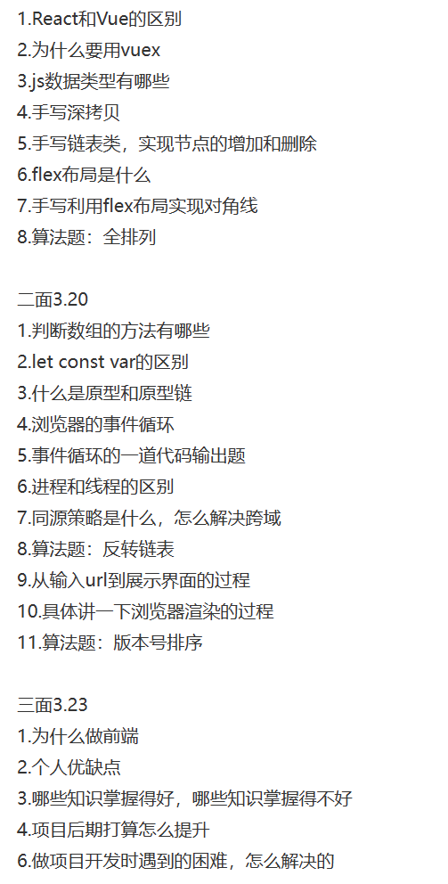
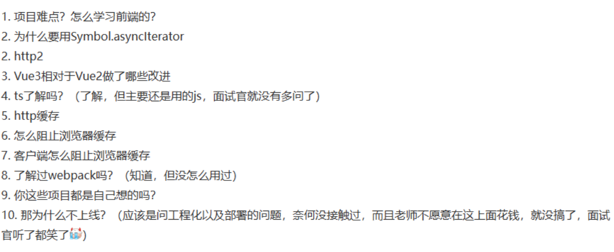
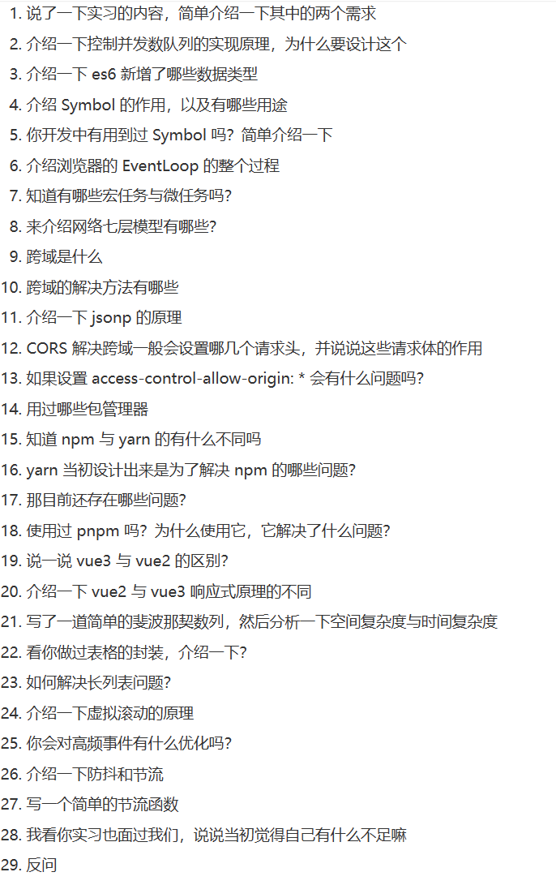

# 面经

1. 介绍一下控制并发数队列的实现原理，为什么要设计这个

一些比较大型的应用，需要一次性发几十上百个请求的时候，建立的 TCP 连接很可能阻塞了其他的资源，因此加上这样一个并发控制，可以让资源得以调度，让页面不至于卡死
```
const taskControll = (list, max) => {
  const handle = () => {
    if (list.length) {
      const callback = list.shift();
      callback().then(() => {
        handle();
      });
    }
  };
  for (let i = 0; i < max; i++) handle();
};
```
2. 介绍一下 es6 新增了哪些数据类型

Symbol、BigInt
3. 介绍 Symbol 的作用，以及有哪些用途

Symbol 是一种在ES6 中新添加的数据类型，本质上是一种唯一标识符，可用作对象的唯一属性名，Symbol类型的key是不能通过Object.keys()或者for...in来枚举的它未被包含在对象自身的属性名集合(property names)之中。所以，利用该特性，我们可以把一些不需要对外操作和访问的属性使用Symbol来定义。也正因为这样一个特性，当使用JSON.stringify()将对象转换成JSON字符串的时候，Symbol属性也会被排除在输出内容之外

4. 你开发中有用到过 Symbol 吗？简单介绍一下

同上一题
5. 介绍浏览器的 EventLoop 的整个过程
6. 知道有哪些宏任务与微任务吗？


7. 来介绍网络七层模型有哪些？


应用层 文件传输，电子邮件，文件服务，虚拟终端 TFTP，HTTP，SNMP，FTP，SMTP，DNS，Telnet

表示层 数据格式化，代码转换，数据加密 没有协议

会话层 解除或建立与别的接点的联系 没有协议

传输层 提供端对端的接口 TCP，UDP

网络层 为数据包选择路由 IP，ICMP，RIP，OSPF，BGP，IGMP

数据链路层 传输有地址的帧以及错误检测功能 SLIP，CSLIP，PPP，ARP，RARP，MTU

物理层 以二进制数据形式在物理媒体上传输数据 ISO2110，IEEE802，IEEE802.2
8. 跨域是什么

浏览器出于安全考虑，会有同源策略，即同协议、同域名、同端口
9.  跨域的解决方法有哪些

- JSONP
- CORS （跨资源共享）设置响应头Access-Control-Allow-Origin
- 设置代理
10. 介绍一下 jsonp 的原理

script标签不受浏览器同源策略的影响，可以通过src属性，请求非同源的接口，缺点是：只支持GET数据请求，不支持POET数据请求
11. CORS 解决跨域一般会设置哪几个请求头，并说说这些请求体的作用

Origin：声明源
预检请求：与简单请求不同，“需预检的请求”要求必须首先使用 OPTIONS 方法发起一个预检请求到服务器，以获知服务器是否允许该实际请求。"预检请求“的使用，可以避免跨域请求对服务器的用户数据产生未预期的影响
> OPTIONS /doc HTTP/1.1
> Host: bar.other
> User-Agent: Mozilla/5.0 (Macintosh; Intel Mac OS X 10.14; rv:71.0) Gecko/20100101 Firefox/71.0
> Accept: text/html,application/xhtml+xml,application/xml;q=0.9,*/*;q=0.8
> Accept-Language: en-us,en;q=0.5
> Accept-Encoding: gzip,deflate
> Connection: keep-alive
> Origin: https://foo.example
> Access-Control-Request-Method: POST
> Access-Control-Request-Headers: X-PINGOTHER, Content-Type

> HTTP/1.1 204 No Content
> Date: Mon, 01 Dec 2008 01:15:39 GMT
> Server: Apache/2
> Access-Control-Allow-Origin: https://foo.example
> Access-Control-Allow-Methods: POST, GET, OPTIONS
> Access-Control-Allow-Headers: X-PINGOTHER, Content-Type
> Access-Control-Max-Age: 86400
> Vary: Accept-Encoding, Origin
> Keep-Alive: timeout=2, max=100
> Connection: Keep-Alive

> POST /doc HTTP/1.1
> Host: bar.other
> User-Agent: Mozilla/5.0 (Macintosh; Intel Mac OS X 10.14; rv:71.0) Gecko/20100101 Firefox/71.0
> Accept: text/html,application/xhtml+xml,application/xml;q=0.9,*/*;q=0.8
> Accept-Language: en-us,en;q=0.5
> Accept-Encoding: gzip,deflate
> Connection: keep-alive
> X-PINGOTHER: pingpong
> Content-Type: text/xml; charset=UTF-8
> Referer: https://foo.example/examples/preflightInvocation.html
> Content-Length: 55
> Origin: https://foo.example
> Pragma: no-cache
> Cache-Control: no-cache

> HTTP/1.1 200 OK
> Date: Mon, 01 Dec 2008 01:15:40 GMT
> Server: Apache/2
> Access-Control-Allow-Origin: https://foo.example
> Vary: Accept-Encoding, Origin
> Content-Encoding: gzip
> Content-Length: 235
> Keep-Alive: timeout=2, max=99
> Connection: Keep-Alive
> Content-Type: text/plain

12. 如果设置 access-control-allow-origin: * 会有什么问题吗？

> **安全性问题**： 允许任何域的网站访问你的资源可能会引发安全风险，特别是当资源包含敏感信息时。攻击者可以利用这种设置来访问敏感数据或执行恶意操作。
> **信息泄露**： 如果你的网站允许任何域的请求，那么攻击者可以通过在恶意网站上执行JavaScript来获取你网站上的信息，甚至可能盗取用户的个人信息。
> **CSRF（跨站请求伪造）攻击**： 攻击者可以通过伪造请求来执行潜在的恶意操作，因为他们可以发送跨域请求到你的服务器，服务器会接受这些请求并执行操作。
> **信任问题**： 允许任何域的请求可能会降低用户对你的网站的信任，因为他们无法确定访问他们数据的是谁。
13. 用过哪些包管理器
14. 知道 npm 与 yarn 的有什么不同吗
性能： yarn在性能方面通常比npm更快。yarn使用并行下载和缓存机制，能够更快地下载和安装依赖包，特别是在较大的项目中。
缓存机制： yarn使用了一个全局缓存来存储下载过的依赖，这使得多个项目可以共享同一个缓存，从而减少了重复下载的情况。npm 5及以后的版本也引入了类似的本地缓存机制。
版本解析： yarn使用yarn.lock文件来确保依赖的版本一致性，而npm使用package-lock.json。yarn的锁定机制在依赖版本解析上更严格一些，可以避免不同开发环境下的不一致性。
15. yarn 当初设计出来是为了解决 npm 的哪些问题？
- 性能问题
- 版本一致问题
- npm早期的安全问题
16. 那目前还存在哪些问题？
17. 使用过 pnpm 吗？为什么使用它，它解决了什么问题？
18. 说一说 vue3 与 vue2 的区别？

Vue 2： Vue 2使用了基于Object.defineProperty的响应性系统，这个系统有一些限制，比如无法直接监听数组的变化，需要使用特定的方法来操作数组。
Vue 3： Vue 3引入了一个全新的响应性系统，基于Proxy对象。这个系统更加强大和灵活，可以更好地处理对象和数组的变化
19. 介绍一下 vue2 与 vue3 响应式原理的不同

Vue 2 响应式原理
在Vue 2中，响应式系统是基于Object.defineProperty实现的，这个系统允许Vue追踪数据的变化并更新界面。当一个对象被传入Vue实例的数据选项中时，Vue会递归地将对象的每个属性转换为响应式属性，通过getter和setter来实现。
Getter 和 Setter： Vue 2会在对象的属性上使用getter和setter。当获取属性值时，会记录依赖关系，当属性值改变时，会通知相关的依赖进行更新。
递归转换： Vue 2会递归地将对象的所有属性转换为响应式属性，这意味着对象一旦被添加到Vue实例的数据选项中，它的属性就会变成响应式的。
数组特殊处理： 对于数组，Vue 2会重写数组的一些原型方法，使得这些方法能够触发界面更新，从而实现数组的响应式。

Vue 3 响应式原理：
Vue 3在响应式方面进行了重大改进，使用了基于Proxy的新响应式系统。这个系统更加强大和灵活，同时也解决了Vue 2中一些限制。
Proxy 对象： Vue 3使用Proxy对象来实现响应式。通过Proxy，可以在访问和修改属性时进行拦截，实现更细粒度的响应式控制。
深层代理： Vue 3的响应式系统可以深层代理对象的属性，包括嵌套对象的属性。这样就不需要像Vue 2那样递归地转换对象的每个属性。
Map 和 Set： Vue 3的响应式系统也支持Map和Set等数据结构，这是Vue 2中所不具备的。
数组特殊处理： 在Vue 3中，数组的处理更加一致和可预测。通过Proxy，数组的所有操作都可以被拦截，从而实现数组的响应式
20. 写了一道简单的斐波那契数列，然后分析一下空间复杂度与时间复杂度
21. 看你做过表格的封装，介绍一下？
22. 如何解决长列表问题？
23. 介绍一下虚拟滚动的原理

滚动事件本身不会造成太多的性能消耗，而是因为滚动事件伴随有大量的元素参与进来一起进行回流的操作才会影响浏览器的性能
虚拟滚动其实就是综合数据分页和无限滚动的方法，在有限的视口中只渲染我们所能看到的数据，超出视口之外的数据就不进行渲染，可以通过计算可视范围内的但单元格，保证每一次滚动渲染的DOM元素都是可以控制的，不会担心像数据分页一样一次性渲染过多，也不会发生像无限滚动方案那样会存在数据堆积，是一种很好的解决办法。

24. 你会对高频事件有什么优化吗？

利用防抖和节流，减少高频事件的触发
25. 介绍一下防抖和节流

防抖：连续点击的情况下不会执行，只在最后一下点击过指定的秒数后才会执行
应用场景：点击按钮，输入框模糊查询，词语联想等

节流：频繁触发的时候，比如滚动或连续点击，在指定的间隔时间内，只会执行一次
应用场景：resize、scroll等
26. 写一个简单的节流函数

```
    const btn = document.getElementById("btn");

    function debounce() {
      console.log(1);
      let timeout = null; //此处的timeout用了闭包的特性
      return () => {
        // 每一次点击判断有延迟执行的任务就停止
        if (timeout !== null) clearTimeout(timeout);
        // 否则就开启延迟任务
        timeout = setTimeout(() => {
          console.log("防抖");
        }, 1000);
      };
    }

    btn.addEventListener("click", debounce());
```

```
    const btn = document.getElementById("btn");
    const throttle = (fn, wait, ...arg) => {
      let date = Date.now();
      return function () {
        let now = Date.now();
        if (now - date > wait) {
          fn.apply(this, arg);
          date = now;
        }
      };
    };
    const f = (name) => {
      console.log(name, "节流成功");
    };

    btn.addEventListener("click", throttle(f, 1000, '张三'));
```





