# 面经

1. 介绍一下控制并发数队列的实现原理，为什么要设计这个

一些比较大型的应用，需要一次性发几十上百个请求的时候，建立的 TCP 连接很可能阻塞了其他的资源，因此加上这样一个并发控制，可以让资源得以调度，让页面不至于卡死
```
const taskControll = (list, max) => {
  const handle = () => {
    if (list.length) {
      const callback = list.shift();
      callback().then(() => {
        handle();
      });
    }
  };
  for (let i = 0; i < max; i++) handle();
};
```
2. 介绍一下 es6 新增了哪些数据类型

Symbol、BigInt
3. 介绍 Symbol 的作用，以及有哪些用途

Symbol 是一种在ES6 中新添加的数据类型，本质上是一种唯一标识符，可用作对象的唯一属性名，Symbol类型的key是不能通过Object.keys()或者for...in来枚举的它未被包含在对象自身的属性名集合(property names)之中。所以，利用该特性，我们可以把一些不需要对外操作和访问的属性使用Symbol来定义。也正因为这样一个特性，当使用JSON.stringify()将对象转换成JSON字符串的时候，Symbol属性也会被排除在输出内容之外

4. 你开发中有用到过 Symbol 吗？简单介绍一下

同上一题
5. 介绍浏览器的 EventLoop 的整个过程
6. 知道有哪些宏任务与微任务吗？

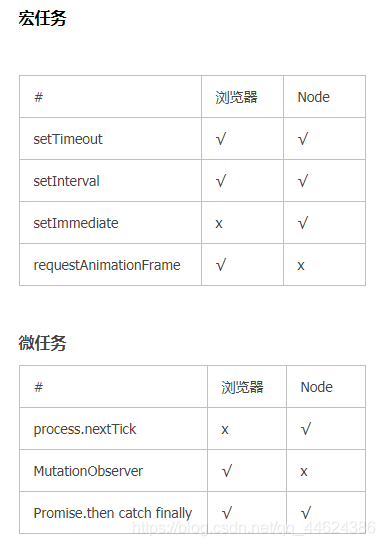
7. 来介绍网络七层模型有哪些？

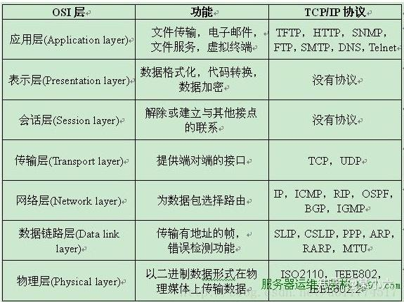
应用层 文件传输，电子邮件，文件服务，虚拟终端 TFTP，HTTP，SNMP，FTP，SMTP，DNS，Telnet

表示层 数据格式化，代码转换，数据加密 没有协议

会话层 解除或建立与别的接点的联系 没有协议

传输层 提供端对端的接口 TCP，UDP

网络层 为数据包选择路由 IP，ICMP，RIP，OSPF，BGP，IGMP

数据链路层 传输有地址的帧以及错误检测功能 SLIP，CSLIP，PPP，ARP，RARP，MTU

物理层 以二进制数据形式在物理媒体上传输数据 ISO2110，IEEE802，IEEE802.2
8. 跨域是什么

浏览器出于安全考虑，会有同源策略，即同协议、同域名、同端口
9.  跨域的解决方法有哪些

- JSONP
- CORS （跨资源共享）设置响应头Access-Control-Allow-Origin
- 设置代理
10. 介绍一下 jsonp 的原理

script标签不受浏览器同源策略的影响，可以通过src属性，请求非同源的接口，缺点是：只支持GET数据请求，不支持POET数据请求
11. CORS 解决跨域一般会设置哪几个请求头，并说说这些请求体的作用

Origin：声明源
预检请求：与简单请求不同，“需预检的请求”要求必须首先使用 OPTIONS 方法发起一个预检请求到服务器，以获知服务器是否允许该实际请求。"预检请求“的使用，可以避免跨域请求对服务器的用户数据产生未预期的影响
> OPTIONS /doc HTTP/1.1
> Host: bar.other
> User-Agent: Mozilla/5.0 (Macintosh; Intel Mac OS X 10.14; rv:71.0) Gecko/20100101 Firefox/71.0
> Accept: text/html,application/xhtml+xml,application/xml;q=0.9,*/*;q=0.8
> Accept-Language: en-us,en;q=0.5
> Accept-Encoding: gzip,deflate
> Connection: keep-alive
> Origin: https://foo.example
> Access-Control-Request-Method: POST
> Access-Control-Request-Headers: X-PINGOTHER, Content-Type

> HTTP/1.1 204 No Content
> Date: Mon, 01 Dec 2008 01:15:39 GMT
> Server: Apache/2
> Access-Control-Allow-Origin: https://foo.example
> Access-Control-Allow-Methods: POST, GET, OPTIONS
> Access-Control-Allow-Headers: X-PINGOTHER, Content-Type
> Access-Control-Max-Age: 86400
> Vary: Accept-Encoding, Origin
> Keep-Alive: timeout=2, max=100
> Connection: Keep-Alive

> POST /doc HTTP/1.1
> Host: bar.other
> User-Agent: Mozilla/5.0 (Macintosh; Intel Mac OS X 10.14; rv:71.0) Gecko/20100101 Firefox/71.0
> Accept: text/html,application/xhtml+xml,application/xml;q=0.9,*/*;q=0.8
> Accept-Language: en-us,en;q=0.5
> Accept-Encoding: gzip,deflate
> Connection: keep-alive
> X-PINGOTHER: pingpong
> Content-Type: text/xml; charset=UTF-8
> Referer: https://foo.example/examples/preflightInvocation.html
> Content-Length: 55
> Origin: https://foo.example
> Pragma: no-cache
> Cache-Control: no-cache

> HTTP/1.1 200 OK
> Date: Mon, 01 Dec 2008 01:15:40 GMT
> Server: Apache/2
> Access-Control-Allow-Origin: https://foo.example
> Vary: Accept-Encoding, Origin
> Content-Encoding: gzip
> Content-Length: 235
> Keep-Alive: timeout=2, max=99
> Connection: Keep-Alive
> Content-Type: text/plain

12. 如果设置 access-control-allow-origin: * 会有什么问题吗？

> **安全性问题**： 允许任何域的网站访问你的资源可能会引发安全风险，特别是当资源包含敏感信息时。攻击者可以利用这种设置来访问敏感数据或执行恶意操作。
> **信息泄露**： 如果你的网站允许任何域的请求，那么攻击者可以通过在恶意网站上执行JavaScript来获取你网站上的信息，甚至可能盗取用户的个人信息。
> **CSRF（跨站请求伪造）攻击**： 攻击者可以通过伪造请求来执行潜在的恶意操作，因为他们可以发送跨域请求到你的服务器，服务器会接受这些请求并执行操作。
> **信任问题**： 允许任何域的请求可能会降低用户对你的网站的信任，因为他们无法确定访问他们数据的是谁。
13. 用过哪些包管理器
14. 知道 npm 与 yarn 的有什么不同吗
性能： yarn在性能方面通常比npm更快。yarn使用并行下载和缓存机制，能够更快地下载和安装依赖包，特别是在较大的项目中。
缓存机制： yarn使用了一个全局缓存来存储下载过的依赖，这使得多个项目可以共享同一个缓存，从而减少了重复下载的情况。npm 5及以后的版本也引入了类似的本地缓存机制。
版本解析： yarn使用yarn.lock文件来确保依赖的版本一致性，而npm使用package-lock.json。yarn的锁定机制在依赖版本解析上更严格一些，可以避免不同开发环境下的不一致性。
15. yarn 当初设计出来是为了解决 npm 的哪些问题？
- 性能问题
- 版本一致问题
- npm早期的安全问题
16. 那目前还存在哪些问题？
17. 使用过 pnpm 吗？为什么使用它，它解决了什么问题？
18. 说一说 vue3 与 vue2 的区别？

Vue 2： Vue 2使用了基于Object.defineProperty的响应性系统，这个系统有一些限制，比如无法直接监听数组的变化，需要使用特定的方法来操作数组。
Vue 3： Vue 3引入了一个全新的响应性系统，基于Proxy对象。这个系统更加强大和灵活，可以更好地处理对象和数组的变化
19. 介绍一下 vue2 与 vue3 响应式原理的不同

Vue 2 响应式原理
在Vue 2中，响应式系统是基于Object.defineProperty实现的，这个系统允许Vue追踪数据的变化并更新界面。当一个对象被传入Vue实例的数据选项中时，Vue会递归地将对象的每个属性转换为响应式属性，通过getter和setter来实现。
Getter 和 Setter： Vue 2会在对象的属性上使用getter和setter。当获取属性值时，会记录依赖关系，当属性值改变时，会通知相关的依赖进行更新。
递归转换： Vue 2会递归地将对象的所有属性转换为响应式属性，这意味着对象一旦被添加到Vue实例的数据选项中，它的属性就会变成响应式的。
数组特殊处理： 对于数组，Vue 2会重写数组的一些原型方法，使得这些方法能够触发界面更新，从而实现数组的响应式。

Vue 3 响应式原理：
Vue 3在响应式方面进行了重大改进，使用了基于Proxy的新响应式系统。这个系统更加强大和灵活，同时也解决了Vue 2中一些限制。
Proxy 对象： Vue 3使用Proxy对象来实现响应式。通过Proxy，可以在访问和修改属性时进行拦截，实现更细粒度的响应式控制。
深层代理： Vue 3的响应式系统可以深层代理对象的属性，包括嵌套对象的属性。这样就不需要像Vue 2那样递归地转换对象的每个属性。
Map 和 Set： Vue 3的响应式系统也支持Map和Set等数据结构，这是Vue 2中所不具备的。
数组特殊处理： 在Vue 3中，数组的处理更加一致和可预测。通过Proxy，数组的所有操作都可以被拦截，从而实现数组的响应式
20. 写了一道简单的斐波那契数列，然后分析一下空间复杂度与时间复杂度
21. 看你做过表格的封装，介绍一下？
22. 如何解决长列表问题？
23. 介绍一下虚拟滚动的原理

滚动事件本身不会造成太多的性能消耗，而是因为滚动事件伴随有大量的元素参与进来一起进行回流的操作才会影响浏览器的性能
虚拟滚动其实就是综合数据分页和无限滚动的方法，在有限的视口中只渲染我们所能看到的数据，超出视口之外的数据就不进行渲染，可以通过计算可视范围内的但单元格，保证每一次滚动渲染的DOM元素都是可以控制的，不会担心像数据分页一样一次性渲染过多，也不会发生像无限滚动方案那样会存在数据堆积，是一种很好的解决办法。

24. 你会对高频事件有什么优化吗？

利用防抖和节流，减少高频事件的触发
25. 介绍一下防抖和节流

防抖：连续点击的情况下不会执行，只在最后一下点击过指定的秒数后才会执行
应用场景：点击按钮，输入框模糊查询，词语联想等

节流：频繁触发的时候，比如滚动或连续点击，在指定的间隔时间内，只会执行一次
应用场景：resize、scroll等
26. 写一个简单的节流函数

```
    const btn = document.getElementById("btn");

    function debounce() {
      console.log(1);
      let timeout = null; //此处的timeout用了闭包的特性
      return () => {
        // 每一次点击判断有延迟执行的任务就停止
        if (timeout !== null) clearTimeout(timeout);
        // 否则就开启延迟任务
        timeout = setTimeout(() => {
          console.log("防抖");
        }, 1000);
      };
    }

    btn.addEventListener("click", debounce());
```

```
    const btn = document.getElementById("btn");
    const throttle = (fn, wait, ...arg) => {
      let date = Date.now();
      return function () {
        let now = Date.now();
        if (now - date > wait) {
          fn.apply(this, arg);
          date = now;
        }
      };
    };
    const f = (name) => {
      console.log(name, "节流成功");
    };

    btn.addEventListener("click", throttle(f, 1000, '张三'));
```


27. js模块化
常见的模块化有commonjs、AMD、CMD、es6 module四种规范
> commonjs,是nodejs中默认采用的模块化规范，也就是我们常见的require('**')那种,引用其他模块的方式是require，后面的参数可以是第三方模块的名称（保证此时第三方模块已经安装在你的node_modules中），也可以是模块文件的地址，返回值是一个对象，在浏览器中使用时需要browserify包将模块打包成浏览器支持的模式。 输出值拷贝而非地址的加载机制(AMD、CMD规范均采用的是这种方式，而es6 module输出为引用)

**AMD与CMD的区别**
虽然都是并行加载js文件，但还是有所区别，AMD是预加载，在并行加载js文件同时，还会解析执行该模块（因为还需要执行，所以在加载某个模块前，这个模块的依赖模块需要先加载完成）；而CMD是懒加载，虽然会一开始就并行加载js文件，但是不会执行，而是在需要的时候才执行
```
const axios = require("axios");// 引用axios包导出的对象
const subModule = require("./modules/subModule.js");// 引用./modules/subModule.js文件中导出的对象
```
> 导出的方式有两种，一种是使用module.exports导出整个对象,一种是是使用exports单独导出每一个key:
```
//./modules/subModule.js文件
let obj = {a: 1, b: 2}
module.exports = obj

//./modules/subModule.js文件
let obj = {a: 1, b: 2}
module.exports = obj
```

**AMD**
> 在commonjs中，模块是同步加载的（毕竟它是设计给服务端nodejs的），也就是说，即使不需要依赖其他模块的代码，依然需要等待前面模块加载完毕之后才能开始执行，在模块越来越大之后无疑会损失更多性能，因此AMD（Asynchronous Module Definition 异步模块定义）便应运而生，AMD的用法如下
```
//nodejs默认采用的是cjs规范，因此不能直接使用AMD模块化的方式，需要借助第三方库，常用的支持AMD模块化的库是requirejs
npm i requirejs --save
```
```
// index.js
var requirejs = require('requirejs');

requirejs.config({
  paths: {
    libAMD: 'module/index',
    subModule: 'module/index2'
  }
})

requirejs(["libAMD"], function(libAMD) {
  console.log(libAMD.count)
  libAMD.countPlus()
  console.log(libAMD.count)

  console.log(libAMD.submodule.name)
})
```

```
// module/index.js
define(["subModule"], function(submodule) {     //这里导入了subModule模块
  let count = 0;

  function countPlus() {
    count += 1;
  }

  return {count, countPlus, submodule};
})

```

```
// module/index2.js
define([], function() {
  return {name: 'I’m a sub module'}
})
```
执行结果：
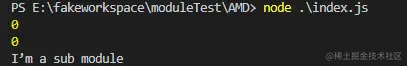


> 在浏览器端使用AMD的方式也比较简单，只要在主函数执行前加载requirejs库即可，引用和导出方式与在服务端使用AMD规范基本相同。


**CMD**
> CMD的基本逻辑跟AMD是一致的，只不过在写法上CMD采用了cjs的部分语法，且CMD仅支持浏览器端使用，并在模块加载方面针对浏览器端运行的代码做了些许优化。同样需要引入三方库来支持CMD规范，比较常用的是sea.js
```
<script src="https://cdn.bootcdn.net/ajax/libs/seajs/3.0.3/sea.js"></script>
<script>
  seajs.config({
    base: './module/',
    alias: {
      libAMD: 'index.js',
      subModule: 'index2.js'
    }
  })

  seajs.use('./main.js')
</script>
```
```
// main.js
define(function(require) {
  let libAMD = require("libAMD")

  console.log(libAMD.count)
  libAMD.countPlus()
  console.log(libAMD.count)

  console.log(libAMD.submodule.name)
})

```
```
// module/index.js
define(function(require, exports, module) {
  let count = 0;

  function countPlus() {
    count += 1;
  }

  let submodule = require("subModule");

  module.exports = {count, countPlus, submodule};
})

```
```
define(function(require, exports, module) {
  exports.name = 'I’m a sub module'
})
```
模块导出则可以在回调函数中获得exports和module对象，依然按照cjs的方法进行使用。


28. 是否了解typeof？
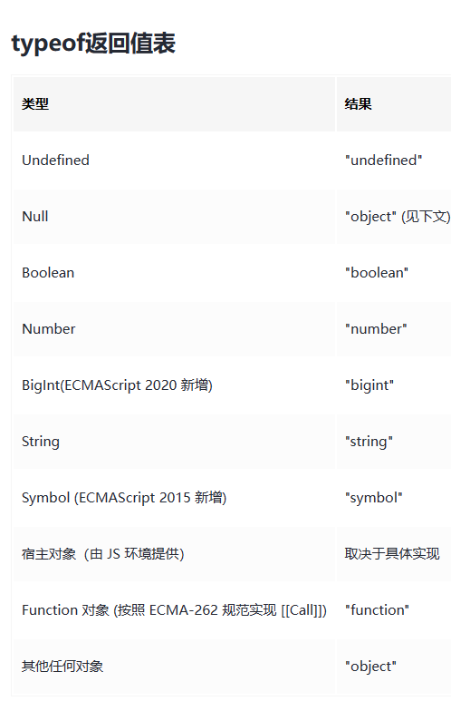
对未定义的变量使用typeof检测也会返回一个“undefined”。不会报错。但在加入了块级作用域的 let 和 const 之后，在其被声明之前对块中的 let 和 const 变量使用 typeof 会抛出一个 ReferenceError。块作用域变量在块的头部处于“暂存死区”，直至其被初始化，在这期间，访问变量将会引发错误。

暂时性死区：在解析代码时，JavaScript 引擎也会注意出现在块后面的 let 声明，只不过在此之前不能以任何方式来引用未声明的变量。在 let 声明之前的执行瞬间被称为“暂时性死区”。简单来说就是在使用let、const声明变量之前访问这个变量就会报错。
```
typeof undeclaredVariable === 'undefined'; // 不会抛出错误
typeof newLetVariable; // ReferenceError
typeof newConstVariable; // ReferenceError
typeof newClass; // ReferenceError

let newLetVariable;
const newConstVariable = 'hello';
class newClass{};
```
**为什么 typeof null === 'object';？**
这里其实是一个JavaScript历史遗留问题，需要从JavaScript底层是如何存储数据的类型信息讲起。

在 JS 的最初版本中使用的是 32 位系统，为了性能考虑使用低位存储变量的类型信息，000 开头代表是对象然而 null 表示为全零，所以将它错误的判断为 object
typeof原理： 不同的对象在底层都表示为二进制，在Javascript中二进制前（低）三位存储其类型信息。
000: 对象 010: 浮点数 100：字符串 110： 布尔 1： 整数
null：所有机器码均为0

29. 所有基本类型的值都是不可改变的。

```
var bar = "baz";
bar[0] = "a";
console.log(bar[0]);  //b
console.log(bar);     //baz
```
> 所有基本类型的值都是不可改变的，这里变量bar指向了"bar"字符串，通过bar[0]赋值并不会修改基础数据类型


30. 除了typeof 还有其它获取具体类型的方法吗
- instanceof instanceof 运算符用于检测构造函数的 prototype 属性是否出现在某个实例对象的原型链上。即检测对象A是否为对象B的实例。但是判断不了A具体是什么数据类型，B要求是对象类型。instanceof能够检查object、date、array、function等引用类型，但是检查不了number、boolean、string 等基本数据类型。
- constructor(不推荐) constructor 在其对应对象的原型下面，是自动生成的。当我们写一个构造函数的时候，程序会自动添加：构造函数名.prototype.constructor = 构造函数名，constructor属性是可以被修改的，会导致检测出的结果不正确。
- Object.prototype.toString.call()（推荐）Object上有两个toString方法，一个在Object本身，另一个在Object.prototype原型对象上。Object.prototype上的toString()方法具有判断数据类型的功能。默认情况下，toString() 方法被每个 Object 对象继承。如果此方法在自定义对象中未被覆盖，toString() 返回 “[object type]”，其中 type 是对象的类型。也就是说，Object本身上的toString()方法是继承了原型上的方法后进行了重写。Array，function等类型作为Object的实例，都重写了toString()方法，调用的时候直接调用重写的toString()方法。

31. 实现bind方法
```
Function.prototype.bind = function () {
  var _this = this;
  var context = arguments[0];
  var arg = [].slice.call(arguments, 1);
  return function () {
    arg = [].concat.apply(arg, arguments);
    _this.apply(context, arg);
  };
};

const test = (s1, s2) => {
  console.log(s1, s2);
};

test.bind(null, "张三", "李四")();
```
bind有个特性，bind方法可以分多次传参，最后函数运行时会把所有参数连接起来一起放入函数运行。

32. 了解事件委托机制吗？捕获和冒泡阶段
就是把目标节点的事件绑定到祖先节点上。这种简单而优雅的事件注册方式是基于事件传播过程中，逐层冒泡总能被祖先节点捕获。
为什么要用事件委托：
- 节省监听数，节省内存
- 可以监听动态元素，对于js动态生成的元素只能通过事件委托来监听

33. target和currTarget区别
target 是对触发事件的对象的引用
currentTarget 当事件遍历DOM时，标识事件的当前目标。它总是引用事件处理程序附加到的元素（事件绑定的元素，不一定是那个真实DOM,因为会冒泡）
简单例子
```
<div id="a">
  <div id="b">
    <div id="c">
      <div id="d">哈哈哈哈哈</div>
    </div>
  </div>
</div>

const a = document.getElementById('a')
const b = document.getElementById('b')
const c = document.getElementById('c')
const d = document.getElementById('d')
a.addEventListener('click', (e) => {
  const {
    target,
    currentTarget
  } = e
  console.log(`target是${target.id}`)
  console.log(`currentTarget是${currentTarget.id}`)
})
b.addEventListener('click', (e) => {
  const {
    target,
    currentTarget
  } = e
  console.log(`target是${target.id}`)
  console.log(`currentTarget是${currentTarget.id}`)
})
c.addEventListener('click', (e) => {
  const {
    target,
    currentTarget
  } = e
  console.log(`target是${target.id}`)
  console.log(`currentTarget是${currentTarget.id}`)
})
d.addEventListener('click', (e) => {
  const {
    target,
    currentTarget
  } = e
  console.log(`target是${target.id}`)
  console.log(`currentTarget是${currentTarget.id}`)
})

```

输出结果
target是d currentTarget是d
target是d currentTarget是c
target是d currentTarget是b
target是d currentTarget是a

34. 了解进程和线程吗？说说你对进程和线程的了解

一个程序必定包含>=1个进程，
一个进程必定包含>=1个线程，
进程之间不共享内存，每多一个进程就要多分配一定的内存。
多个线程共享内存，因此多线程可以提高程序的并发性。

JS单线程带来的好处：

JS主要是面向浏览器的，因此是和用户实时交互的，如果多线程执行的话，你无法确定同时开始的任务哪个会先结束，以网页加载为例，可能导致网页HTML结构已经加载好，但是CSS样式还未加载完成，导致用户浏览体验差。或者两个线程同时对一个DOM结点进行修改和删除操作，则无法判断以哪个线程为准。
为了利用多核 CPU 的计算能力，HTML5 提出 Web Worker 标准，允许 JavaScript 脚本创建多个线程，但是子线程完全受主线程控制，且不得操作 DOM。所以，这个新标准并没有改变 JavaScript 单线程的本质。

但是浏览器是多进程的，简单理解是打开一个tab页相当于创立一个独立的浏览器进程，同时还包括Browser进程（也叫控制进程），第三方插件进程，GPU进程，浏览器渲染进程
**渲染进程**
> 浏览器的渲染进程是多线程的。

渲染进程的主要常驻线程:
- GUI渲染线程
  - 负责渲染浏览器界面，解析HTML，CSS，构建DOM树和RenderObject树，布局和绘制等
  - 当界面需要重绘（Repaint）或由于某种操作引发回流(reflow)时，该线程就会执行
- JS引擎线程（JS内核）
  - 负责处理Javascript脚本程序（例如V8引擎）
  - JS引擎一直等待着任务队列中任务的到来，然后加以处理，一个Tab页（renderer进程）中无论什么时候都只有一个JS线程在运行JS程序
- 事件触发线程（解释了事件循环）
  - 归属于浏览器而不是JS引擎，用来控制事件循环（可以理解，JS引擎自己都忙不过来，需要浏览器另开线程协助）
  - 当JS引擎执行代码块如setTimeOut时（或是来自浏览器内核的其他线程，如鼠标点击、AJAX异步请求等），会将对应任务添加到事件线程中
  - 当对应的事件符合触发条件被触发时，该线程会把事件添加到待处理队列的队尾，等待JS引擎的处理
  - 注意，由于JS的单线程关系，所以这些待处理队列中的事件都得排队等待JS引擎处理（当JS引擎空闲时才会去执行）
- 定时触发器线程
  - 传说中的setInterval与setTimeout所在线程；
  - 浏览器定时计数器并不是由JavaScript引擎计数的（因为JavaScript引擎是单线程的，如果处于阻塞线程状态就会影响记计时的准确）
  - 因此通过单独线程来计时并触发定时（计时完毕后，添加到事件队列中，等待JS引擎空闲后执行）
- 异步http请求线程
  - XMLHttpRequest在连接后是通过浏览器新开一个线程请求
  - 
> 注意，GUI渲染线程与JS引擎线程是互斥的，当JS引擎执行时GUI线程会被挂起（即js的解析会阻止dom元素的渲染），GUI更新会被保存在一个队列中等到JS引擎空闲时立即被执行。所以如果JS执行的时间过长，这样就会造成页面的渲染不连贯，导致页面渲染加载阻塞。


35. 浏览器渲染流程
> 简化理解，前期准备工作略掉，浏览器输入url，浏览器主进程接管，开一个下载线程，然后进行http请求（略去DNS查询，IP寻址等等操作），然后等待响应，获取内容，随后将内容通过RendererHost接口转交给Renderer进程，浏览器渲染流程开始。

**渲染大概分为以下几个步骤**
- 解析html建立dom树；
- 解析css构建render树（将CSS代码解析成树形的数据结构，然后结合DOM合并成render树）；
- 布局render树（Layout/reflow），负责各元素尺寸、位置的计算；
- 绘制render树（paint），绘制页面像素信息；

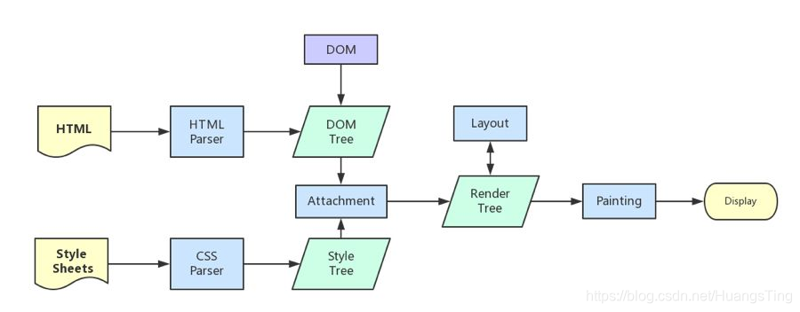

渲染完毕后就是load事件了，之后就是自己的JS逻辑处理了。
**1.load事件与DOMContentLoaded事件的先后**
上面提到，渲染完毕后会触发load事件，那么你能分清楚load事件与DOMContentLoaded事件的先后么？
当 DOMContentLoaded 事件触发时，仅当DOM加载完成，不包括样式表，图片。(譬如如果有async加载的脚本就不一定完成)
当 onload 事件触发时，页面上所有的DOM，样式表，脚本，图片都已经加载完成了。（渲染完毕了）
所以，顺序是：DOMContentLoaded => load

**2.css加载是否会阻塞dom树渲染？**
> css是由单独的下载线程异步下载的,所以css加载不会阻塞DOM树解析（异步加载时DOM照常构建），但会阻塞render树渲染（渲染时需等css加载完毕，因为render树需要css信息）这可能也是浏览器的一种优化机制。
因为你加载css的时候，可能会修改下面DOM节点的样式，如果css加载不阻塞render树渲染的话，那么当css加载完之后，render树可能又得重新重绘或者回流了，这就造成了一些没有必要的损耗。
所以干脆就先把DOM树的结构先解析完，把可以做的工作做完，然后等你css加载完之后，在根据最终的样式来渲染render树，这种做法性能方面确实会比较好一点。

**从Event Loop谈JS的运行机制**
JavaScript是单线程，怎样执行异步的代码 ？

单线程就意味着，所有任务需要排队，前一个任务结束，才会执行后一个任务。如果前一个任务耗时很长，后一个任务就不得不一直等着。
js 引擎执行异步代码之所以不用等待，是因有为有消息队列和事件循环。
> 消息队列：消息队列（也叫任务队列）是一个先进先出的队列，它里面存放着各种消息（任务）
> 事件循环：事件循环是指主线程重复从消息队列中取消息、执行的过程。
实际上，主线程只会做一件事情，就是从消息队列里面取消息、执行消息，再取消息、再执行。当消息队列为空时，就会等待直到消息队列变成非空。而且主线程只有在将当前的消息执行完成后，才会去取下一个消息。这种机制就叫做事件循环机制，取一个消息并执行的过程叫做一次循环。
> 消息就是注册异步任务时添加的回调函数。
> 消息队列中又会细分微任务、宏任务
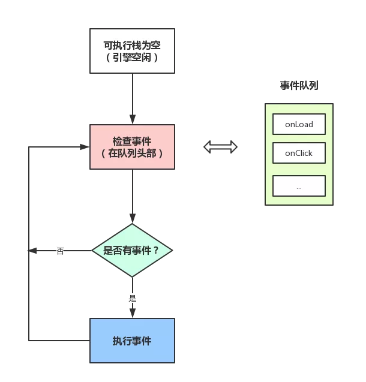

36. 定时器
在调用setTimeout后，是如何等待特定时间后才添加到事件队列中的？
它是由定时器线程控制（因为JS引擎自己都忙不过来，根本无暇分身）
为什么要有单独的定时器线程？因为JavaScript引擎是单线程的，如果处于阻塞线程状态就会影响记计时的准确，因此很有必要单独开一个线程用来计时。
当使用setTimeout或setInterval时，它需要定时器线程计时，计时完成后就会将特定的事件推入事件队列中。

37. 手写发布订阅模式
```
class EventBus {
  constructor() {
    this.list = {};
  }

  on(event, cb) {
    if (this.list[event] === undefined) {
      this.list[event] = [];
    }
    this.list[event].push(cb);
  }

  emit(event, ...args) {
    if (this.list[event]) {
      this.list[event].forEach((item) => {
        item(...args);
      });
    }
  }

  off(event, cb) {
    if (this.list[event]) {
      for (let i = 0; i < this.list[event].length; i++) {
        if (cb === this.list[event][i]) {
          this.list[event].splice(i, 1);
          return;
        }
      }
    }
  }
}

const event = new EventBus();
//累加求和
const add = (...args) => console.log(args[0] + args[1]);
//打印参数
const log = (...args) => console.log(...args);

event.on("add", add);
event.on("log", log);
event.emit("add", 1, 2); // 3
event.emit("log", "hi"); // hi
event.off("add", add);
```

38. 尾递归

```
//斐波拉契数列
//传统递归写法
const fibonacci = (n) => {
  if (n === 0 || n === 1) return n;
  else return fibonacci(n - 2) + fibonacci(n - 1);
};

//尾递归优化
const tailFibonacci = (n, n1, n2) => {
  if (n === 0) return n1;
  else return tailFibonacci(n - 1, n2, n1 + n2);
};

console.log(fibonacci(5), tailFibonacci(5, 0, 1));

//n的阶乘
//传统写法
const factorial = (n) => {
  if (n === 1) return 1;
  else return factorial(n - 1) + n;
};

const tailFactorial = (n, sum) => {
  if (n === 0) return sum;
  else return tailFactorial(n - 1, sum + n);
};

console.log(factorial(5), tailFactorial(5, 0));

```

39. 观察者模式和发布订阅模式区别
观察者模式由至少两个对象组成，观察者和被观察者，通过被观察者建立联系，一个被观察者可以被多个观察者观测，被观察者将观察者加入列表中，当触发相应事件时通知观察者执行相应发放
发布订阅模式至少由三个对象组成，发布者、订阅者、事件中心，订阅者通过事件中心订阅，发布者通过事件中心发布消息，在一定程度上起到了解耦的作用

40. json序列化

**json在js中支持的三种类型**
- 简单值：字符串、数值、bool、null可以在JSON中出现，undefined不可以，symbol不可以
- 数组
- 对象

**json不能将undefined和symbol序列化，是json方法深拷贝的缺陷**
json序列化规则
- 对于JavaScript中的六种原始类型，JSON语法支持数字、字符串、布尔值、null四种，不支持undefined，Symbol
- NaN、Infinity和-Infinity序列化的结果是null
- JSON语法不支持函数
- 对于Set，Map，RegExp、Error对象，JSON语法无法保证序列化安全
- 日期对象序列化的结果是ISO格式的字符串（调用了Date对象的toJSON方法），但JSON.parse()依然保留它们字符串形态，并不会将其还原为日期对象
- JSON.stringify()只能序列化对象的可枚举的自有属性

41. get 属性可以被序列化出来吗

可以，对于普通的 JavaScript 对象而言，它的属性默认都是可枚举的，因此在被序列化时，其所有属性都会被包含在序列化后的字符串中。而 get 关键字定义的操作符只是属性访问器的一种方式，本质上仍然是一个属性，因此也是可枚举的，可以被序列化出来。**get属性也是可枚举的**

42. JavaScript对象中的可枚举属性和不可枚举属性
在JavaScript中，对象的属性有可枚举和不可枚举之分它是由对象属性描述符enumerable决定的。如果该属性是可枚举性的那么这个属性就能被for…in查找遍历到。在JavaScript中可以通过Object.defineProperty()来为对象设置属性描述符。

43. 把一张图片序列化到json里面，有什么方式
- 使用Base64编码
- 使用URL引用

44. 如何通过原型修改第三方类库，来实现自己的功能而不破坏类库？手写一下
```
//原始的第三方库
function Person(name, age) {
    this.name = name;
    this.age = age;
}

Person.prototype.sayHello = function() {
    console.log("Hello, I am " + this.name);
};

//使用原型链来增加新的方法
Person.prototype.introduce = function() {
    this.sayHello();
    console.log("I am " + this.age + " years old.");
};

// 测试
var tom = new Person("Tom", 25);
tom.introduce(); // 输出：Hello, I am Tom \n I am 25 years old.
```
**不要随意改变或覆盖第三方库中已经存在的方法**

45. 并发和并行
并发是指一个处理器同时处理多个任务。
并行是指多个处理器或者是多核的处理器同时处理多个不同的任务。
并发是逻辑上的同时发生（simultaneous），而并行是物理上的同时发生。
来个比喻：并发是一个人同时吃三个馒头，而并行是三个人同时吃三个馒头。

46. 浏览器垃圾回收机制
**V8回收策略**
分代回收策略 将内存分成新生代和老生代 对新老生代采取不同的回收策略

新生代内存回收
系统会给新生代分配一片内存空间，将这块空间分为from、to两部分，from是正在使用的空间，to是空闲的空间，当浏览器开始进行垃圾回收时，会检查from空间，如果不是存活的对象，会直接回收，存活的对象会复制到右边的to空间；等再有新生代的对象产生时，form、to左右对调、这样做的好处是处理一些零散的内存碎片

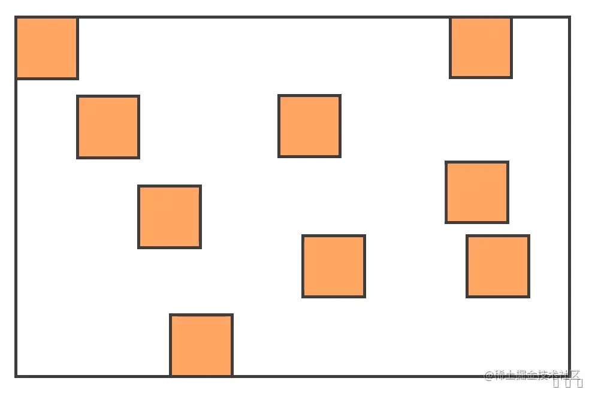
图中橙色的块代表存活对象，白色地方代表未分配的内存。正常情况下，由于堆内存是连续分配的，但是也有可能出现上图的这种内存分配情况，这种零散的分配情况就造成了内存碎片，会影响比较大的内存对象的放置。
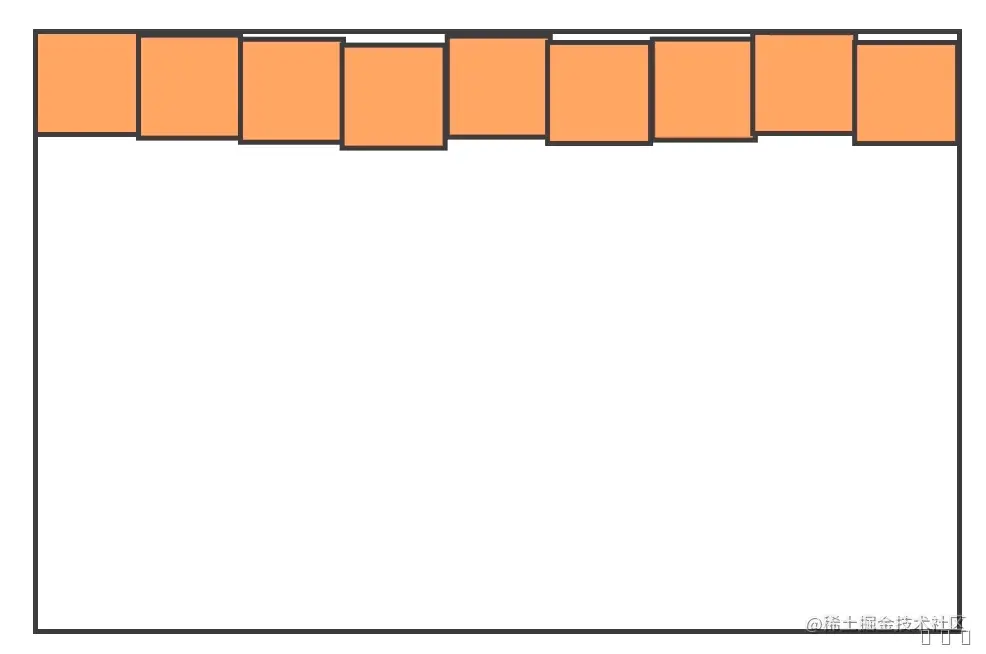
进行这样的算法处理，明显会让内存排布变得更整齐了，这样就非常方便之后新来的对象的内存分配。

老生代内存回收
那么新生代中的变量如果经过回收之后依然一直存在，那么就会被放入到老生代内存中。时间长了之后通过几个原因的判断，我们就会把这些变量进行 "晋升"

那么老生代内存中的垃圾回收，是采用什么样的策略进行的呢？这里采用了 Mark-Sweep（标记清除） 和 Mark-Compact（标记整理）的策略
**标记清除**
首先它会遍历堆上的所有的对象，分别对它们打上标记；然后在代码执行过程结束之后，对使用过的变量取消标记。那么没取消标记的就是没有使用过的变量，因此在清除阶段，就会把还有标记的进行整体清除，从而释放内存空间。但是其实通过标记清除之后，还是会出现上面图中的内存碎片的问题。因此就需要使用到标记整理策略（Mark-Compact）
**标记整理**
为了方便解决浏览器中的内存碎片问题，标记整理这个策略被提出。这个策略是在标记清除的基础上演进而来的，和标记清除来对比来看，标记整理添加了活动对象整理阶段，处理过程中会将所有的活动对象往一端靠拢，整体移动完成后，直接清理掉边界外的内存。其操作效果如下图所示。
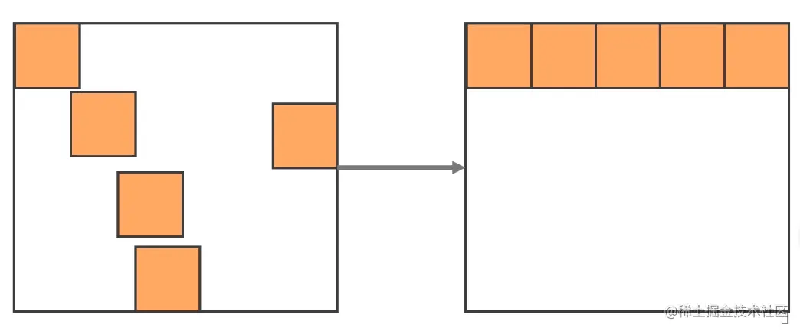


47. 浏览器缓存策略
- 域名解析，DNS缓存
- 本地缓存（memory缓存）
- Http缓存（强缓存和协商缓存）
- 服务端缓存（cdn缓存）

dns解析会对网络请求带来一定损耗所以浏览器在第一次获取到IP地址后，会将其缓存起来。下次相同域名再次发起请求时，浏览器会先查找本地缓存，如果缓存有效，则会直接返回该IP地址，否则会继续开始寻址之旅。
- 首先搜索浏览器自身的DNS缓存,如果存在，则域名解析到此完成。
- 如果浏览器自身的缓存里面没有找到对应的条目，那么会尝试读取操作系统的hosts文件看是否存在对应的映射关系,如果存在，则域名解析到此完成。
- 如果本地hosts文件不存在映射关系，则查找本地DNS服务器(ISP服务器,或者自己手动设置的DNS服务器),如果存在,域名到此解析完成
- 如果本地DNS服务器还没找到的话,它就会向根服务器发出请求,进行迭代查询。

memory cache（本地缓存）
memory cache 是浏览器为了加快读取缓存速度而进行的自身的优化行为，不受开发者控制，也不受 HTTP 协议头的约束。当资源被存入内存后，下次同样的请求将不再通过网络，而是直接访问内存，当关闭该页面时，此资源就被内存释放掉了，再次重新打开相同页面时不再出现from memory cache的情况。
那什么时候资源会被放入memory缓存呢？
答案是几乎所有的网络请求资源都会根据相关的策略被浏览器自动加入到 memory cache 中。但是也正因为数量很大但是浏览器占用的内存不能无限扩大这样两个因素，memory cache 注定只能是个“短期存储”。当数据量过大，即使网页不关闭，缓存依然会失效。

disk cache（硬盘缓存）
硬盘缓存取决于HTTP中的响应头信息，它也是浏览器缓存中最重要的内容。
HTTP所控制下的 disk cache 缓存分为强制缓存和协商缓存
**强缓存**
对于强缓存，控制它的字段分别是：Expires和Cache-Control，其中Cache-Control优先级比Expires高。
当客户端发出一个请求到服务器，服务器希望你把资源缓存起来，于是在响应头中加入了这些内容
```
Cache-Control: max-age=3600 我希望你把这个资源缓存起来，缓存时间是3600秒（1小时）
Expires: Thu, 10 Nov 2020 08:45:11 GMT 到达指定时间过期
Date: Thu, 30 Apr 2020 12:39:56 GMT
Etag:W/"121-171ca289ebf"，(后面协商缓存内容)这个资源的编号是W/"121-171ca289ebf"
Last-Modified:Thu, 30 Apr 2020 08:16:31 GMT，(后面协商缓存内容)这个资源的上一次修改时间
```
Cache-Control和 Expires分别是HTTP/1.1 和 HTTP/1.0的内容，为了兼容 HTTP/1.0 和 HTTP/1.1，实际项目中两个字段我们都会设置。
浏览器收到这个响应之后就会做下面的事情
- 浏览器把这次请求得到的响应体缓存到本地文件中
- 浏览器标记这次请求的请求方法和请求路径
- 浏览器标记这次缓存的时间是3600秒
- 浏览器记录服务器的响应时间


判断缓存是否有效就是通过把max-age + Date，得到一个过期时间，看看这个过期时间是否大于当前时间，如果是，则表示缓存还没有过期，仍然有效，如果不是，则表示缓存失效。

**协商缓存**
一旦发现缓存无效，它并不会简单的把缓存删除，而是抱着一丝希望，想问问服务器，我这个缓存还能继续使用吗？
于是，浏览器向服务器发出了一个带缓存的请求
所谓带缓存的请求，无非就是加入了以下的请求头：
```
If-Modified-Since: Thu, 30 Apr 2020 08:16:31 GMT  亲，你曾经告诉我，这个资源的上一次修改时间是格林威治时间2020-04-30 08:16:31，请问这个资源在这个时间之后有发生变动吗？
If-None-Match: W/"121-171ca289ebf"  亲，你曾经告诉我，这个资源的编号是W/"121-171ca289ebf，请问这个资源的编号发生变动了吗？
```
之所以要发两个信息，是为了兼容不同的服务器，因为有些服务器只认If-Modified-Since，有些服务器只认If-None-Match，有些服务器两个都认,但是一般来说 If-None-Match 的优先级高于 If-Modified-Since
此时可能会产生两个结果
- 缓存失效，服务器再次给予一个正常的响应（响应码200 带响应体），同时可以附带上新的缓存指令，浏览器缓存新的内容
- 缓存有效，服务器返回304重定向，并且响应头带上新的缓存指令，浏览器作出相应缓存动作


48. cookie、localstorage、sessionStorage

| 特性           | Cookie                                                                             | localStorage                                   | sessionStorage                               |
| -------------- | ---------------------------------------------------------------------------------- | ---------------------------------------------- | -------------------------------------------- |
| 数据的生命期   | 一般由服务器生成，可设置失效时间。如果在浏览器端生成Cookie，默认是关闭浏览器后失效 | 除非被清除，否则永久保存                       | 仅在当前会话下有效，关闭页面或浏览器后被清除 |
| 存放数据大小   | 4KB左右                                                                            | 一般为5MB                                      | 同localstroage                               |
| 与服务器端通信 | 每次都会携带在HTTP头中，发送给服务端。但是使用cookie保存过多数据会带来性能问题     | 仅在客户端（即浏览器）中保存，不和服务器的通信 | 同localstroage                               |


49. get和post的区别

get常是用于获取资源，post常是对资源进行操作
安全性：post相比get更安全，get参数暴露在url中的
幂等性：GET是幂等的，而POST不是。（幂等性是指无论一个操作进行一次或多次，结果都是相同的。）
大小限制：POST请求的数据量基本上没有限制，可以发送大量数据。GET请求的数据长度受到URL长度的限制

50. TCP协议三次握手，四次挥手

**为什么需要三次握手**
- 当client发出的第一个连接请求报文段SYN并没有丢失，而是在某个网络节点长时间的滞留，以导致延误时间释放以后的某个时间才到达server。时间一过，这个报文段是已经失效的
- 但是server收到此失效的连接报文段后，就会以为是client再次发出了一个新的连接请求，于是就向client发出确认报文段ACK和SYN，同意建立连接。
- 加入不采取‘三次握手’，只要server发出确认，新的连接就建立了。由于现在client并没有发出建立连接的请求，因此不会理睬server的确认，也不会向server发送数据。但server却以为新的运输连接已经建立，并一直等待client发来数据。这样，server的很多资源就白白浪费掉了
- 采用‘三次握手’就可以防止上述现象发生。例如刚才那种情况，client不会向server的确认发出确认，server由于收不到确认，就知道client并没有要求建立连接。主要目的是防止server一直等待，浪费资源。

**为什么需要四次挥手**
- 第一次是TCP客户端发送一个FIN，用来关闭客户到服务器的数据传送
- 第二次是服务器收到这个FIN后，它发回一个ACK,确认序号为收到的序号+1，和SYN一样，一个FIN将占有一个序号
- 第三次是服务器关闭客户端的连接，发送一个FIN给客户端
- 第四次客户端发回ACK报文确认，并将确认序号设置为收到序号+1

为什么服务器在收到客户端的FIN后，不一起发送ACK和FIN呢？
原因是因为tcp是全双工模式，server接受到FIN时意味将没有数据再发来，但是还是可以继续发送数据。（server可能此刻正在发送数据，还没发送完）。所以只能先回复一个ACK报文，告诉client，你发的FIN报文我收到了。只有等server所有的报文都发送完了，server才发生FIN报文，因此不能一起发送，所以需要四步挥手。


51. WeakMap的特性
- WeakMap中存储的是许多键值对的无序列表，列表的键名必须是非null的对象(map可以是任意类型)，对应的值可以是任意类型
- WeaMap对键名是弱引用的，键值是正常引用
- 因为垃圾回收机制可能随时清除其中的对象，所以不可以进行forEach( )遍历等操作
- 因为弱引用，WeaMap 结构没有keys( )，values( )，entries( )等方法和 size 属性

具体使用场景：
将一个 DOM 节点作为键名存入该实例，并将一些附加信息作为键值，一起存放在 WeakMap 里面。这时，WeakMap 里面对element的引用就是弱引用，一旦将这个 DOM 节点删除，该element对象就会自动被垃圾回收机制清除，不存在内存泄漏风险。

存储私有变量


52. 如何创建私有变量
```
//特权方法实现
class myObject {
  constructor() {
         let value = 123
         
         this.getValue = () => {
             return value
         }
         
         this.setValue = (newValue) => {
             value = newValue
         }
     }
}

const o = new MyObject()
 ​
o.getValue()
// 123
o.value
// undefined
​
o.setValue(233)
​
o.getValue()
// 233


//静态私有属性，需要使用一个立即执行函数来构建一个私有作用域
const MyObject = (function() {
     let value = 123
 ​
     class MyObject {
         constructor() {
             // ...
         }
 ​
         getValue() {
             return value
         }
 ​
         setValue(newValue) {
             value = newValue
         }
     }
 ​
     return MyObject
 })()
 ​
 const o = new MyObject()
 const o2 = new MyObject()
 ​
 o2.getValue === o.getValue
 // true
 ​
 o.getValue()
 // 123
 o.value
 // undefined
 ​
 o.setValue(233)
 ​
 o.getValue()
 // 233
 o2.getValue()
 // 233


//使用Symbol实现每个实例有自己的私有变量

const MyObject = (function() {
     let _value = Symbol('value')
     
     class MyObject {
         constructor() {
             this[_value] = 123
         }
         
         getValue() {
             return this[_value]
         }
 ​
         setValue(newValue) {
             this[_value] = newValue
         }
     }
     
     return MyObject
 })()
 ​
 const o = new MyObject()
 ​
 o[Symbol('value')]
 // undefined
 ​
 o.getValue()
 // 123

//模块模式
const singleton = function() {
     let value = 123
     
     return {
         // 其他公有属性
         getValue() {
             return value
         },
         setValue(newValue) {
             value = newValue
         }
     }
 }()
const singletono = function() {
     let value = 123
     
     const object = new SomeType()
     
     object.publicProperty = true
     
     object.getValue = function() {
         return value
     }
     
     object.setValue = function(newValue) {
         value = newValue
     }
     
     return object
 }()
//这样就可以返回一个能够被 instanceof 操作符确定类型的对象，同时这个对象还有着对应的私有变量和操作私有变量的特权方法（有点类似于继承中的 寄生式继承 ）


//ES提案，私有类字段
class MyObject {
     #value = 123

     getValue() {
         return this.#value
     }

     setValue(newValue) {
         this.#value = newValue
     }
 }
 
 const o = new MyObject()
 
 o.#value
 // Uncaught SyntaxError: Private field '#value' must be declared in an enclosing class
 
 o.getValue()

```

53. symbol类型的特性
- Symbol 值通过 Symbol 函数生成，使用 typeof，结果为 "symbol"
- Symbol 函数前不能使用 new 命令，否则会报错。这是因为生成的 Symbol 是一个原始类型的值，不是对象。
- instanceof 的结果为 false（左边是基础数据类型都返回false）
- Symbol 函数可以接受一个字符串作为参数，表示对 Symbol 实例的描述，主要是为了在控制台显示，或者转为字符串时，比较容易区分。
- 如果 Symbol 的参数是一个对象，就会调用该对象的 toString 方法，将其转为字符串，然后才生成一个 Symbol 值。
- Symbol 函数的参数只是表示对当前 Symbol 值的描述，相同参数的 Symbol 函数的返回值是不相等的。
- Symbol 值不能与其他类型的值进行运算，会报错
- Symbol 值可以显式转为字符串。
- Symbol 作为属性名，该属性不会出现在 for...in、for...of 循环中，也不会被 Object.keys()、Object.getOwnPropertyNames()、JSON.stringify() 返回。但是，它也不是私有属性，有一个 Object.getOwnPropertySymbols 方法，可以获取指定对象的所有 Symbol 属性名

共享 symbol
要创建一个共享的symbol，要使用Symbol.for()函数，而不是Symbol()。
```
let ssn = Symbol.for('ssn');
let nz = Symbol.for('ssn');
console.log(ssn === nz); // true
```
如果想要获取symbol的键，使用Symbol.keyFor()方法
```
console.log(Symbol.keyFor(nz)); // 'ssn'
//注意，如果symbol是通过Symbol()创建的，使用Symbol.keyFor()会返回undefined
let systemID = Symbol('sys');
console.log(Symbol.keyFor(systemID)); // undefined
```

54. Object.prototype.toString判断类型的原理
[[Class]] 类属性

对象的类属性（class attribute）是一个字符串，用以表示对象的类型信息。ES3和ES5都没有提供设置这个属性的方法，并只有一种间接的方法可以查询到它。默认的toString方法（继承自Object.prototype）返回了如下格式的字符串：[object class] 因此，想要获得对象的类，可以调用对象的toString方法

**js中每个类型都有自己私有的[[Class]]属性，而且这个class是不能被任何人修改的，他可以细分内置构造函数创建的类对象，但是，无法区分自定义对象类型**

55. 前端A页面如何与B页面通信

同源策略
通常，对于两个不同页面的脚本，只有当执行它们的页面位于具有相同的协议（通常为https），端口号（443为https的默认值），以及主机 (两个页面的模数 Document.domain设置为相同的值) 时，这两个脚本才能相互通信。

- BroadCast Channel：BroadcastChannel “广播频道”接口代理了一个命名频道，可以让指定 origin 下的任意 browsing context 来订阅它。它允许同源的不同浏览器窗口，Tab页，frame或者 iframe 下的不同文档之间相互通信。通过触发一个 message 事件，消息可以广播到所有监听了该频道的 BroadcastChannel 对象。他与window.postMessage的区别在于BroadcastChannel只能用于同源的页面之间进行通信，而window.postMessage却可以用于任何的页面之间
- LocalStorage：他受同源策略的影响。StorageEvent这个与它相关的事件，通过监听storage事件即可收到通知。
- Service Worker：Service Worker 是一个可以长期运行在后台的 Worker，能够实现与页面的双向通信。多页面共享间的 Service Worker 可以共享，将 Service Worker 作为消息的处理中心（中央站）即可实现广播效果。注意：**Service Worker需要https协议的支持**
- Shared Worker：是 Worker 家族的另一个成员。普通的 Worker 之间是独立运行、数据互不相通；而多个 Tab 注册的 Shared Worker 则可以实现数据共享。Shared Worker 在实现跨页面通信时的问题在于，它无法主动通知所有页面，因此，我们会使用轮询的方式，来拉取最新的数据。
- IndexedDB：除了可以利用 Shared Worker 来共享存储数据，还可以使用其他一些“全局性”（支持跨页面）的存储方案。例如 IndexedDB 或 cookie。
- window.open + window.opener：


在“广播模式”外，我们又了解了“共享存储+长轮询”这种模式。也许你会认为长轮询没有监听模式优雅，但实际上，有些时候使用“共享存储”的形式时，不一定要搭配长轮询。

例如，在多 Tab 场景下，我们可能会离开 Tab A 到另一个 Tab B 中操作；过了一会我们从 Tab B 切换回 Tab A 时，希望将之前在 Tab B 中的操作的信息同步回来。这时候，其实只用在 Tab A 中监听visibilitychange这样的事件，来做一次信息同步即可。

非同源策略
非同源页面之间的通信
- iframe
- window.postmessage()


56. promise.all和race的区别是什么
Promise.all 是一个用于并行处理多个 Promise 对象的方法。它接收一个包含 Promise 对象的数组作为参数，并返回一个新的 Promise 对象。当传入的所有 Promise 对象都变为 fulfilled 状态时，新的 Promise 对象才会变为 fulfilled 状态，并且返回由这些 Promise 对象的结果组成的数组；如果其中任何一个 Promise 对象变为 rejected 状态，新的 Promise 对象就会立即变为 rejected 状态，并返回第一个被 rejected 的 Promise 对象的结果。
 
Promise.race 是一个用于竞争多个 Promise 对象的方法。它接收一个包含 Promise 对象的数组作为参数，并返回一个新的 Promise 对象。当传入的任何一个 Promise 对象变为 fulfilled 或 rejected 状态时，新的 Promise 对象就会变为相应状态，并且返回该 Promise 对象的结果或错误。

57. es模块化
传统方法
HTML 网页中，浏览器通过 script 标签加载 JavaScript 脚本
```
<!-- 页面内嵌的脚本 -->
<script type="application/javascript">
  // module code
</script>
<!-- 外部脚本 -->
<script type="application/javascript" src="path/to/myModule.js">
</script>
```
上面代码中，由于浏览器脚本的默认语言是 JavaScript，因此type="application/javascript"可以省略。
默认情况下，浏览器是同步加载 JavaScript 脚本，即渲染引擎遇到 **script** 标签就会停下来，等到执行完脚本，再继续向下渲染。如果是外部脚本，还必须加入脚本下载的时间。

如果脚本体积很大，下载和执行的时间就会很长，因此造成浏览器堵塞，用户会感觉到浏览器“卡死”了，没有任何响应。这显然是很不好的体验，所以浏览器允许脚本异步加载，下面就是两种异步加载的语法。
```
<script src="path/to/myModule.js" defer></script>
<script src="path/to/myModule.js" async></script>
```

上面代码中，**script** 标签打开defer或async属性，脚本就会异步加载。渲染引擎遇到这一行命令，就会开始下载外部脚本，但不会等它下载和执行，而是直接执行后面的命令。

defer与async的区别是：defer要等到整个页面在内存中正常渲染结束（DOM 结构完全生成，以及其他脚本执行完成），才会执行；async一旦下载完，渲染引擎就会中断渲染，执行这个脚本以后，再继续渲染。一句话，defer是“渲染完再执行”，async是“下载完就执行”。另外，如果有多个defer脚本，会按照它们在页面出现的顺序加载，而多个async脚本是不能保证加载顺序的。

es6加载模块
览器加载 ES6 模块，也使用 **script** 标签，但是要加入type="module"属性。
```
<script type="module" src="./foo.js"></script>
```
浏览器对于带有type="module"的 **script**，都是异步加载，不会造成堵塞浏览器，即等到整个页面渲染完，再执行模块脚本，等同于打开了 **script** 标签的defer属性。
```
<script type="module" src="./foo.js"></script>
<!-- 等同于 -->
<script type="module" src="./foo.js" defer></script>
```
 **script** 标签的async属性也可以打开，这时只要加载完成，渲染引擎就会中断渲染立即执行。执行完成后，再恢复渲染。
 一旦使用了async属性，就不会按照在页面出现的顺序执行，而是只要该模块加载完成，就执行该模块。

ES6 模块也允许内嵌在网页中，语法行为与加载外部脚本完全一致。
```
<script type="module">
  import utils from "./utils.js";
  // other code
</script>
```
对于外部模块需要注意的点
- 代码是在模块作用域之中运行，而不是在全局作用域运行。模块内部的顶层变量，外部不可见。
- 模块脚本自动采用严格模式，不管有没有声明use strict
- 模块之中，可以使用import命令加载其他模块（.js后缀不可省略，需要提供绝对 URL 或相对 URL），也可以使用export命令输出对外接口。
- 模块之中，顶层的this关键字返回undefined，而不是指向window。也就是说，在模块顶层使用this关键字，是无意义的。
- 同一个模块如果加载多次，将只执行一次。

58. ES6 模块与 CommonJS 模块的差异
- CommonJS 模块输出的是一个值的拷贝（浅拷贝），ES6 模块输出的是值的引用。
- CommonJS 模块是运行时加载，ES6 模块是编译时输出接口。

第二个差异是因为 CommonJS 加载的是一个对象（即module.exports属性），该对象只有在脚本运行完才会生成。而 ES6 模块不是对象，它的对外接口只是一种静态定义，在代码静态解析阶段就会生成。JS 引擎对脚本静态分析的时候，遇到模块加载命令import，就会生成一个只读引用。等到脚本真正执行时，再根据这个只读引用，到被加载的那个模块里面去取值

59. let和const特性
- 没有变量提升（变量提升只是提升到当前作用域的顶部，function也会带来变量提升，并且允许重复定义）
- 暂时性死区
- 不允许重复声明
- 块作用域


**暂时性死区**
```
var tmp = 123;
if (true) {
  tmp = 'abc'; // ReferenceError
  let tmp;
}
```
只要块级作用域内存在let命令，它所声明的变量就“绑定”（binding）这个区域，不再受外部的影响。

**注意这两个报错的信息有小差异**
```
console.log(a)    //ReferenceError: a is not defined

//=========================================
console.log(a)    //ReferenceError: Cannot access 'a' before initialization

let a;
```

60. 顶层对象

顶层对象，在浏览器环境指的是window对象，在 Node 指的是global对象。ES5 之中，顶层对象的属性与全局变量是等价的。
```
window.a = 1;
a // 1
a = 2;
window.a // 2
```
顶层对象的属性与全局变量挂钩，被认为是 JavaScript 语言最大的设计败笔之一。这样的设计带来了几个很大的问题，首先是没法在编译时就报出变量未声明的错误，只有运行时才能知道（因为全局变量可能是顶层对象的属性创造的，而属性的创造是动态的）；其次，程序员很容易不知不觉地就创建了全局变量（比如打字出错）；最后，顶层对象的属性是到处可以读写的，这非常不利于模块化编程。另一方面，window对象有实体含义，指的是浏览器的窗口对象，顶层对象是一个有实体含义的对象，也是不合适的。

ES6 为了改变这一点，一方面规定，为了保持兼容性，var命令和function命令声明的全局变量，依旧是顶层对象的属性；另一方面规定，let命令、const命令、class命令声明的全局变量，不属于顶层对象的属性。也就是说，从 ES6 开始，全局变量将逐步与顶层对象的属性脱钩

```
var a = 1;
// 如果在 Node 的 REPL 环境，可以写成 global.a
// 或者采用通用方法，写成 this.a
window.a // 1
let b = 1;
window.b // undefined
```
61. globalThis 对象
JavaScript 语言存在一个顶层对象，它提供全局环境（即全局作用域），所有代码都是在这个环境中运行。但是，顶层对象在各种实现里面是不统一的。
- 浏览器里面，顶层对象是window，但 Node 和 Web Worker 没有window。
- 浏览器和 Web Worker 里面，self也指向顶层对象，但是 Node 没有self。
- Node 里面，顶层对象是global，但其他环境都不支持。

同一段代码为了能够在各种环境，都能取到顶层对象，现在一般是使用this变量，但是有局限性。
- 全局环境中，this会返回顶层对象。但是，Node 模块和 ES6 模块中，this返回的是当前模块。
- 函数里面的this，如果函数不是作为对象的方法运行，而是单纯作为函数运行，this会指向顶层对象。但是，严格模式下，这时this会返回undefined。
- 不管是严格模式，还是普通模式，new Function('return this')()，总是会返回全局对象。但是，如果浏览器用了 CSP（Content Security Policy，内容安全策略），那么eval、new Function这些方法都可能无法使用。

62. es6函数扩展
**函数参数的默认值**
```
function foo(x = 5, y = 6) {
  console.log(x, y);
}
foo(undefined, null)
// 5 null
```
上面代码中，x参数对应undefined，结果触发了默认值，y参数等于null，就没有触发默认值。

**函数的 length 属性**
指定了默认值以后，函数的length属性，将返回没有指定默认值的参数个数。也就是说，指定了默认值后，length属性将失真。
```
(function (a) {}).length // 1
(function (a = 5) {}).length // 0
(function (a, b, c = 5) {}).length // 2
```

length属性的含义是，该函数预期传入的参数个数。某个参数指定默认值以后，预期传入的参数个数就不包括这个参数了。同理，后文的 rest 参数也不会计入length属性。
```
(function(...args) {}).length // 0
```

如果设置了默认值的参数不是尾参数，那么length属性也不再计入后面的参数了。
```
(function (a = 0, b, c) {}).length // 0
(function (a, b = 1, c) {}).length // 1
```

**作用域**
```
var x = 1;
function f(x, y = x) {
  console.log(y);
}
f(2) // 2
```
上面代码中，参数y的默认值等于变量x。调用函数f时，参数形成一个单独的作用域。在这个作用域里面，默认值变量x指向第一个参数x，而不是全局变量x，所以输出是2。


```
let x = 1;
function f(y = x) {
  let x = 2;
  console.log(y);
}
f() // 1
```
上面代码中，函数f调用时，参数y = x形成一个单独的作用域。这个作用域里面，变量x本身没有定义，所以指向外层的全局变量x。函数调用时，函数体内部的局部变量x影响不到默认值变量x

如果此时，全局变量x不存在，就会报错。

```
function f(y = x) {
  let x = 2;
  console.log(y);
}
f() // ReferenceError: x is not defined
```
下面这样写，也会报错。
```
var x = 1;
function foo(x = x) {
  // ...
}
foo() // ReferenceError: x is not defined
```
上面代码中，参数x = x形成一个单独作用域。实际执行的是let x = x，由于暂时性死区的原因，这行代码会报错”x 未定义“。

如果参数的默认值是一个函数，该函数的作用域也遵守这个规则。请看下面的例子。
```
let foo = 'outer';
function bar(func = () => foo) {
  let foo = 'inner';
  console.log(func());
}
bar(); // outer
```

**更复杂的例子**
```
var x = 1;
function foo(x, y = function() { x = 2; }) {
  var x = 3;
  y();
  console.log(x);
}
foo() // 3
x // 1
```
上面代码中，函数foo的参数形成一个单独作用域。这个作用域里面，首先声明了变量x，然后声明了变量y，y的默认值是一个匿名函数。这个匿名函数内部的变量x，指向同一个作用域的第一个参数x。函数foo内部又声明了一个内部变量x，该变量与第一个参数x由于不是同一个作用域，所以不是同一个变量，因此执行y后，内部变量x和外部全局变量x的值都没变。

如果将var x = 3的var去除，函数foo的内部变量x就指向第一个参数x，与匿名函数内部的x是一致的，所以最后输出的就是2，而外层的全局变量x依然不受影响。


**rest参数**
rest参数与arguments对象的区别：arguments对象不是数组，而是一个类似数组的对象。所以为了使用数组的方法，必须使用Array.prototype.slice.call先将其转为数组。rest 参数就不存在这个问题，它就是一个真正的数组，数组特有的方法都可以使用。

注意：
- rest 参数之后不能再有其他参数（即只能是最后一个参数），否则会报错。
- 函数的length属性，不包括 rest 参数。

**name属性**
如果将一个匿名函数赋值给一个变量，ES5 的name属性，会返回空字符串，而 ES6 的name属性会返回实际的函数名。
```
var f = function () {};
// ES5
f.name // ""
// ES6
f.name // "f"
```
如果将一个具名函数赋值给一个变量，则 ES5 和 ES6 的name属性都返回这个具名函数原本的名字。
```
const bar = function baz() {};
// ES5
bar.name // "baz"
// ES6
bar.name // "baz"
```

Function构造函数返回的函数实例，name属性的值为anonymous。
```
(new Function).name // "anonymous"
```

bind返回的函数，name属性值会加上bound前缀。 
```
function foo() {};
foo.bind({}).name // "bound foo"
(function(){}).bind({}).name // "bound "
```

**箭头函数的this指向**
this对象的指向是可变的，但是在箭头函数中，它是固定的。在function中，this的指向与调用相关
```
function foo() {
  const handle = () => {
    console.log(this.id)
  }
  handle()
}
var id = 21;
foo.call({ id: 42 });  // id: 42
foo()                  // id: 21

```
上诉代码中如果 handle 是普通函数，执行时this应该指向全局对象window，这时应该输出21。但是，箭头函数导致this总是指向函数定义生效时所在的对象（本例是{id: 42}），所以输出的是42。

箭头函数可以让this指向固定化，这种特性很有利于封装回调函数。

**箭头函数不适用的场景**
第一个场合是定义对象的方法，且该方法内部包括this。
```
const cat = {
  lives: 9,
  jumps: () => {
    this.lives--;
  }
}
```
上面代码中，cat.jumps()方法是一个箭头函数，这是错误的。调用cat.jumps()时，如果是普通函数，该方法内部的this指向cat；如果写成上面那样的箭头函数，使得this指向全局对象，因此不会得到预期结果。这是因为对象不构成单独的作用域，导致jumps箭头函数定义时的作用域就是全局作用域。

第二个场合是需要动态this的时候，也不应使用箭头函数。
```
var button = document.getElementById('press');
button.addEventListener('click', () => {
  this.classList.toggle('on');
});
```

63. es6对象的扩展
**属性的可枚举性和遍历**
对象的每个属性都有一个描述对象（Descriptor），用来控制该属性的行为。Object.getOwnPropertyDescriptor方法可以获取该属性的描述对象。
```
let obj = { foo: 123 };
Object.getOwnPropertyDescriptor(obj, 'foo')
//  {
//    value: 123,
//    writable: true,
//    enumerable: true,
//    configurable: true
//  }
```
描述对象的enumerable属性，称为“可枚举性”，如果该属性为false，就表示某些操作会忽略当前属性。
目前，有四个操作会忽略enumerable为false的属性。
- for...in循环：只遍历对象自身的和继承的可枚举的属性。
- Object.keys()：返回对象自身的所有可枚举的属性的键名。
- JSON.stringify()：只串行化对象自身的可枚举的属性。
- Object.assign()： 忽略enumerable为false的属性，只拷贝对象自身的可枚举的属性。

这四个操作之中，前三个是 ES5 就有的，最后一个Object.assign()是 ES6 新增的。其中，只有for...in会返回继承的属性，其他三个方法都会忽略继承的属性，只处理对象自身的属性。实际上，引入“可枚举”（enumerable）这个概念的最初目的，就是让某些属性可以规避掉for...in操作，不然所有内部属性和方法都会被遍历到。比如，对象原型的toString方法，以及数组的length属性，就通过“可枚举性”，从而避免被for...in遍历到。
```
Object.getOwnPropertyDescriptor(Object.prototype, 'toString').enumerable
// false
Object.getOwnPropertyDescriptor([], 'length').enumerable
// false
```
上面代码中，toString和length属性的enumerable都是false，因此for...in不会遍历到这两个继承自原型的属性。
另外，ES6 规定，所有 Class 的原型的方法都是不可枚举的。总的来说，操作中引入继承的属性会让问题复杂化，大多数时候，我们只关心对象自身的属性。所以，尽量不要用for...in循环，而用Object.keys()代替。

**对象新增方法**
Object.is()
ES5 比较两个值是否相等，只有两个运算符：相等运算符（==）和严格相等运算符（===）。它们都有缺点，前者会自动转换数据类型，后者的NaN不等于自身，以及+0等于-0，Object.is()就是解决这些问题

Object.assign()
Object.assign方法用于对象的合并，将源对象（source）的所有可枚举属性，复制到目标对象（target）。
```
const target = { a: 1 };
const source1 = { b: 2 };
const source2 = { c: 3 };
Object.assign(target, source1, source2);
target // {a:1, b:2, c:3}
```
Object.assign方法的第一个参数是目标对象，后面的参数都是源对象。如果目标对象与源对象有同名属性，或多个源对象有同名属性，则后面的属性会覆盖前面的属性。
```
const target = { a: 1, b: 1 };
const source1 = { b: 2, c: 2 };
const source2 = { c: 3 };
Object.assign(target, source1, source2);
target // {a:1, b:2, c:3}
```

如果只有一个参数，Object.assign会直接返回该参数。
```
const obj = {a: 1};
Object.assign(obj) === obj // true
```

如果该参数不是对象，则会先转成对象，然后返回。
```
typeof Object.assign(2) // "object"
```

由于undefined和null无法转成对象，所以如果它们作为参数，就会报错。
```
Object.assign(undefined) // 报错
Object.assign(null) // 报错
```

如果非对象参数出现在源对象的位置（即非首参数），那么处理规则有所不同。首先，这些参数都会转成对象，如果无法转成对象，就会跳过。这意味着，如果undefined和null不在首参数，就不会报错。
```
let obj = {a: 1};
Object.assign(obj, undefined) === obj // true
Object.assign(obj, null) === obj // true
```
其他类型的值（即数值、字符串和布尔值）不在首参数，也不会报错。但是，除了字符串会以数组形式，拷贝入目标对象，其他值都不会产生效果。
```
const v1 = 'abc';
const v2 = true;
const v3 = 10;
const obj = Object.assign({}, v1, v2, v3);
console.log(obj); // { "0": "a", "1": "b", "2": "c" }
```
上面代码中，v1、v2、v3分别是字符串、布尔值和数值，结果只有字符串合入目标对象（以字符数组的形式），数值和布尔值都会被忽略。这是因为只有字符串的包装对象，会产生可枚举属性。
Object.assign拷贝的属性是有限制的，只拷贝源对象的自身属性（不拷贝继承属性），也不拷贝不可枚举的属性（enumerable: false）。

注意点：
- Object.assign方法实行的是浅拷贝
- 同名属性的替换
- 数组的处理，Object.assign可以用来处理数组，但是会把数组视为对象。
```
Object.assign([1, 2, 3], [4, 5])
// [4, 5, 3]
```
- 取值函数get的处理
```
const source = {
  get foo() { return 1 }
};
const target = {};
Object.assign(target, source)
// { foo: 1 }
```

新增的几个方法
Object.assign：将源对象（source）的所有可枚举属性，复制到目标对象（target）。
Object.keys()：返回一个数组，成员是参数对象自身的（不含继承的）所有可遍历（enumerable）属性的键名。
Object.values()：返回一个数组，成员是参数对象自身的（不含继承的）所有可遍历（enumerable）属性的键值。
Object.entries()：返回一个数组，成员是参数对象自身的（不含继承的）所有可遍历（enumerable）属性的键值对数组。

注意：这几个方法都是操作可枚举的自身属性

64. Symbol的特性
属性名遍历
Symbol 作为属性名，遍历对象的时候，该属性不会出现在for...in、for...of循环中，也不会被Object.keys()、Object.getOwnPropertyNames()、JSON.stringify()返回。但是，它也不是私有属性，有一个Object.getOwnPropertySymbols()方法，可以获取指定对象的所有 Symbol 属性名。该方法返回一个数组，成员是当前对象的所有用作属性名的 Symbol 值。

65. Proxy特性
ES6 原生提供 Proxy 构造函数，用来生成 Proxy 实例。
```
var proxy = new Proxy(target, handler);
```
Proxy 对象的所有用法，都是上面这种形式，不同的只是handler参数的写法。其中，new Proxy()表示生成一个Proxy实例，target参数表示所要拦截的目标对象，handler参数也是一个对象，用来定制拦截行为。
```
var proxy = new Proxy({}, {
  get: function(target, propKey) {
    return 35;
  }
});
proxy.time // 35
proxy.name // 35
proxy.title // 35
```
上面代码中，作为构造函数，Proxy接受两个参数。第一个参数是所要代理的目标对象（上例是一个空对象），即如果没有Proxy的介入，操作原来要访问的就是这个对象；第二个参数是一个配置对象，对于每一个被代理的操作，需要提供一个对应的处理函数，该函数将拦截对应的操作。比如，上面代码中，配置对象有一个get方法，用来拦截对目标对象属性的访问请求。get方法的两个参数分别是目标对象和所要访问的属性。可以看到，由于拦截函数总是返回35，所以访问任何属性都得到35。

注意，要使得Proxy起作用，必须针对Proxy实例（上例是proxy对象）进行操作，而不是针对目标对象（上例是空对象）进行操作。

如果handler没有设置任何拦截，那就等同于直接通向原对象。
```
var target = {};
var handler = {};
var proxy = new Proxy(target, handler);
proxy.a = 'b';
target.a // "b"
```

proxy支持的拦截包括13种
- get(target, propKey, receiver)：拦截对象属性的读取，比如proxy.foo和proxy['foo']。
- set(target, propKey, value, receiver)：拦截对象属性的设置，比如proxy.foo = v或proxy['foo'] = v，返回一个布尔值。
- has(target, propKey)：拦截propKey in proxy的操作，返回一个布尔值。
- deleteProperty(target, propKey)：拦截delete proxy[propKey]的操作，返回一个布尔值。
- ownKeys(target)：拦截Object.getOwnPropertyNames(proxy)、Object.getOwnPropertySymbols(proxy)、Object.keys(proxy)、for...in循环，返回一个数组。该方法返回目标对象所有自身的属性的属性名，而Object.keys()的返回结果仅包括目标对象自身的可遍历属性。
- getOwnPropertyDescriptor(target, propKey)：拦截Object.getOwnPropertyDescriptor(proxy, propKey)，返回属性的描述对象。
- defineProperty(target, propKey, propDesc)：拦截Object.defineProperty(proxy, propKey, propDesc）、Object.defineProperties(proxy, propDescs)，返回一个布尔值。
- preventExtensions(target)：拦截Object.preventExtensions(proxy)，返回一个布尔值。
- getPrototypeOf(target)：拦截Object.getPrototypeOf(proxy)，返回一个对象。
- isExtensible(target)：拦截Object.isExtensible(proxy)，返回一个布尔值。
- setPrototypeOf(target, proto)：拦截Object.setPrototypeOf(proxy, proto)，返回一个布尔值。如果目标对象是函数，那么还有两种额外操作可以拦截。
- apply(target, object, args)：拦截 Proxy 实例作为函数调用的操作，比如proxy(...args)、proxy.call(object, ...args)、proxy.apply(...)。
- construct(target, args)：拦截 Proxy 实例作为构造函数调用的操作，比如new proxy(...args)。

```
var handler = {
  get: function(target, name) {
    if (name === 'prototype') {
      return Object.prototype;
    }
    return 'Hello, ' + name;
  },
  apply: function(target, thisBinding, args) {
    return args[0];
  },
  construct: function(target, args) {
    return {value: args[1]};
  }
};
var fproxy = new Proxy(function(x, y) {
  return x + y;
}, handler);
fproxy(1, 2) // 1
new fproxy(1, 2) // {value: 2}
fproxy.prototype === Object.prototype // true
fproxy.foo === "Hello, foo" // true
```

**this问题**
虽然 Proxy 可以代理针对目标对象的访问，但它不是目标对象的透明代理，即不做任何拦截的情况下，也无法保证与目标对象的行为一致。主要原因就是在 Proxy 代理的情况下，目标对象内部的this关键字会指向 Proxy 代理。
```
const target = {
  m: function () {
    console.log(this === proxy);
  }
};
const handler = {};
const proxy = new Proxy(target, handler);
target.m() // false
proxy.m()  // true
```
面代码中，一旦proxy代理target.m，后者内部的this就是指向proxy，而不是target。

66. Reflect特性
Reflect对象与Proxy对象一样，也是 ES6 为了操作对象而提供的新 API。Reflect对象的设计目的有这样几个。
-  将Object对象的一些明显属于语言内部的方法（比如Object.defineProperty），放到Reflect对象上。现阶段，某些方法同时在Object和Reflect对象上部署，未来的新方法将只部署在Reflect对象上。也就是说，从Reflect对象上可以拿到语言内部的方法。
-  修改某些Object方法的返回结果，让其变得更合理。比如，Object.defineProperty(obj, name, desc)在无法定义属性时，会抛出一个错误，而Reflect.defineProperty(obj, name, desc)则会返回false。
```
// 老写法
try {
  Object.defineProperty(target, property, attributes);
  // success
} catch (e) {
  // failure
}
// 新写法
if (Reflect.defineProperty(target, property, attributes)) {
  // success
} else {
  // failure
}
```
-  让Object操作都变成函数行为。某些Object操作是命令式，比如name in obj和delete obj[name]，而Reflect.has(obj, name)和Reflect.deleteProperty(obj, name)让它们变成了函数行为。
```
// 老写法
'assign' in Object // true
// 新写法
Reflect.has(Object, 'assign') // true
```
- Reflect对象的方法与Proxy对象的方法一一对应，只要是Proxy对象的方法，就能在Reflect对象上找到对应的方法。这就让Proxy对象可以方便地调用对应的Reflect方法，完成默认行为，作为修改行为的基础。也就是说，不管Proxy怎么修改默认行为，你总可以在Reflect上获取默认行为。
```
Proxy(target, {
  set: function(target, name, value, receiver) {
    var success = Reflect.set(target, name, value, receiver);
    if (success) {
      console.log('property ' + name + ' on ' + target + ' set to ' + value);
    }
    return success;
  }
});
```
上面代码中，Proxy方法拦截target对象的属性赋值行为。它采用Reflect.set方法将值赋值给对象的属性，确保完成原有的行为，然后再部署额外的功能。
```
var loggedObj = new Proxy(obj, {
  get(target, name) {
    console.log('get', target, name);
    return Reflect.get(target, name);
  },
  deleteProperty(target, name) {
    console.log('delete' + name);
    return Reflect.deleteProperty(target, name);
  },
  has(target, name) {
    console.log('has' + name);
    return Reflect.has(target, name);
  }
});
```
上面代码中，每一个Proxy对象的拦截操作（get、delete、has），内部都调用对应的Reflect方法，保证原生行为能够正常执行。添加的工作，就是将每一个操作输出一行日志。

67. 使用 Proxy 实现观察者模式

```
const queue = [];
const observe = (callback) => queue.push(callback);
const observable = (obj) =>
  new Proxy(obj, {
    set: (target, key, value) => {
      Reflect.set(target, key, value);
      queue.forEach((item) => {
        item();
      });
    },
  });

const person = observable({
  name: "张三",
  age: 20,
});
function print() {
  console.log(`${person.name}, ${person.age}`);
}
observe(print);
person.name = "李四";

```

68. Iterator（遍历器）的概念
遍历器（Iterator）就是这样一种机制。它是一种接口，为各种不同的数据结构提供统一的访问机制。任何数据结构只要部署 Iterator 接口，就可以完成遍历操作（即依次处理该数据结构的所有成员）。
Iterator 的作用有三个：一是为各种数据结构，提供一个统一的、简便的访问接口；二是使得数据结构的成员能够按某种次序排列；三是 ES6 创造了一种新的遍历命令for...of循环，Iterator 接口主要供for...of消费。
Iterator 的遍历过程
- 创建一个指针对象，指向当前数据结构的起始位置。也就是说，遍历器对象本质上，就是一个指针对象。
- 第一次调用指针对象的next方法，可以将指针指向数据结构的第一个成员。
- 第二次调用指针对象的next方法，指针就指向数据结构的第二个成员。
- 不断调用指针对象的next方法，直到它指向数据结构的结束位置。

每一次调用next方法，都会返回数据结构的当前成员的信息。具体来说，就是返回一个包含value和done两个属性的对象。其中，value属性是当前成员的值，done属性是一个布尔值，表示遍历是否结束。

原生具备 Iterator 接口的数据结构如下。
- Array
- Map
- Set
- String
- TypedArray
- 函数的 arguments 对象
- NodeList 对象
```
let arr = ['a', 'b', 'c'];
let iter = arr[Symbol.iterator]();
iter.next() // { value: 'a', done: false }
iter.next() // { value: 'b', done: false }
iter.next() // { value: 'c', done: false }
iter.next() // { value: undefined, done: true }
```
对于原生部署 Iterator 接口的数据结构，不用自己写遍历器生成函数，for...of循环会自动遍历它们。除此之外，其他数据结构（主要是对象）的 Iterator 接口，都需要自己在Symbol.iterator属性上面部署，这样才会被for...of循环遍历。

对象（Object）之所以没有默认部署 Iterator 接口，是因为对象的哪个属性先遍历，哪个属性后遍历是不确定的，需要开发者手动指定。本质上，遍历器是一种线性处理，对于任何非线性的数据结构，部署遍历器接口，就等于部署一种线性转换。不过，严格地说，对象部署遍历器接口并不是很必要，因为这时对象实际上被当作 Map 结构使用，ES5 没有 Map 结构，而 ES6 原生提供了。

69. HTTP 与 HTTPS 有哪些区别？
- HTTP 是超文本传输协议，信息是明文传输，存在安全风险的问题。HTTPS 则解决 HTTP 不安全的缺陷，在 TCP 和 HTTP 网络层之间加入了 SSL/TLS 安全协议，使得报文能够加密传输。
- HTTP 连接建立相对简单， TCP 三次握手之后便可进行 HTTP 的报文传输。而 HTTPS 在 TCP 三次握手之后，还需进行 SSL/TLS 的握手过程，才可进入加密报文传输。
- 两者的默认端口不一样，HTTP 默认端口号是 80，HTTPS 默认端口号是 443。
- HTTPS 协议需要向 CA（证书权威机构）申请数字证书，来保证服务器的身份是可信的。

https的实现
- 混合加密，HTTPS 采用的是对称加密和非对称加密结合的「混合加密」方式，在通信建立前采用非对称加密的方式交换「会话秘钥」，后续就不再使用非对称加密，在通信过程中全部使用对称加密的「会话秘钥」的方式加密明文数据。
- 摘要算法 + 数字签名，通过哈希算法可以确保内容不会被篡改，但是并不能保证「内容 + 哈希值」不会被中间人替换，因为这里缺少对客户端收到的消息是否来源于服务端的证明。
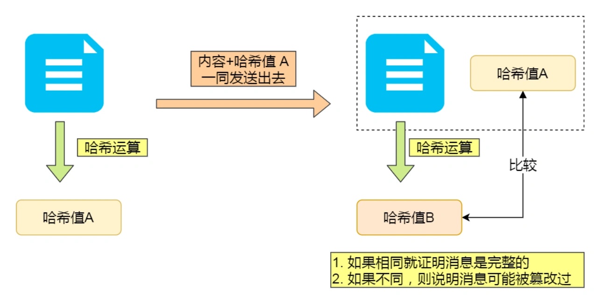
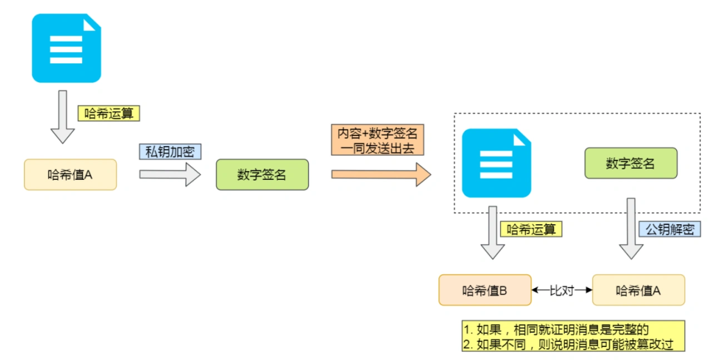
- 数字证书，防止伪造共钥

https的详细过程（TLS协议4次握手过程）
1.首先客户端发送建立连接请求，请求里携带内容包括一个随机数c，客户端支持TLS的版本信息，支持的加密算法信息
2.服务端响应，响应内容包括一个随机数s，确认的版本信息和加密算法还有**数字证书**
3.客户端拿着数字证书去CA验证，数字证书包括两部分（服务端共钥内容+CA数字签名——又公钥哈希值+CA密钥加密生成），客户端通过CA公钥解出hash值对比服务端共钥内容hash值的方式确定公钥是否伪造，拿到公钥后，通过公钥加密一个随机数r发送给服务端，同时通过上面确定的加密算法+随机数c+随机数s+随机数r生成会话密钥
4.服务端响应通过私钥解出随机数r，同样通过确定的加密算法+随机数c+随机数s+随机数r生成会话密钥

**https的加密过程种，生成会话密钥的过程是非对称加密的，之后的内容加密是对称加密**

70. http/1.1 http/2.0 http/3.0分别做了哪些优化
1.1的优化
- 使用长连接的方式改善了 HTTP/1.0 短连接造成的性能开销。
- 支持管道（pipeline）网络传输，只要第一个请求发出去了，不必等其回来，就可以发第二个请求出去，可以减少整体的响应时间。（假并发）

2.0的优化
- 头部压缩
- 二进制格式
- 并发传输（多路复用TCP）
- 服务器主动推送资源

3.0的优化
HTTP/2 通过 Stream 的并发能力，解决了 HTTP/1 队头阻塞的问题，看似很完美了，但是 HTTP/2 还是存在“队头阻塞”的问题，只不过问题不是在 HTTP 这一层面，而是在 TCP 这一层。
HTTP/2 是基于 TCP 协议来传输数据的，TCP 是字节流协议，TCP 层必须保证收到的字节数据是完整且连续的，这样内核才会将缓冲区里的数据返回给 HTTP 应用，那么当「前 1 个字节数据」没有到达时，后收到的字节数据只能存放在内核缓冲区里，只有等到这 1 个字节数据到达时，HTTP/2 应用层才能从内核中拿到数据，这就是 HTTP/2 队头阻塞问题。
HTTP/2 虽然通过多个请求复用一个 TCP 连接解决了 HTTP 的队头阻塞 ，但是一旦发生丢包，就会阻塞住所有的 HTTP 请求，这属于 TCP 层队头阻塞。
3.0使用udp作为传输协议，通过QUIC协议辅助解决udp传输不可靠的问题，udp协议很好的解决了tcp阻塞的问题。它具有类似 TCP 的连接管理、拥塞窗口、流量控制的网络特性，相当于将不可靠传输的 UDP 协议变成“可靠”的了，所以不用担心数据包丢失的问题。

71. TCP 和 UDP 区别
TCP 是面向连接的传输层协议，传输数据前先要建立连接。UDP不需要
TCP 是一对一的两点服务，即一条连接只有两个端点。TCP 是一对一的两点服务，即一条连接只有两个端点。
TCP 有拥塞控制和流量控制机制，保证数据传输的安全性，可靠性
TCP 是字节流传输 UDP是报文传输
每一条TCP连接只能是点到点的；而UDP不建立连接，所以可以支持一对一，一对多，多对一和多对多的交互通信
TCP的首部开销更大

72. 基于 OpenGL ES 的 WebGL 为什么能跑在各个操作系统的浏览器
因为 WebGL 再往下已经可以不是 OpenGL ES 了，在 Windows 上现在是通过 D3D 转译到显卡驱动的，在 macOS 则是 Metal

73. webgl对比webgpu
CPU 负载问题
在 webgl 里，每一次调用 gl.xxx 时，都会完成 CPU 到 GPU 的信号传递，改变 GPU 的状态，是立即生效的（同时cpu与gpu的通信成本很高），webgpu会装配一个CommandBuffer对象，把一切都准备好后再提交gpu

多线程能力
webgl中的gl上下文对象依赖HTML Canvas 元素，所以导致他无法在web wordker中调度 GPU 状态，只能处理数据
webgpu中的上下文对象在 WebWorker 中也可以访问，所以在 Worker 中也可以创建 device，也可以装配出指令缓冲，从而实现多线程提交指令缓冲，实现 CPU 端多线程调度 GPU 的能力。
webgpu实现了通用计算（compute shader）

74. 如何优化WebGL的性能
- 减少WebGL状态切换：WebGL渲染需要进行一系列状态切换，如绑定纹理、绑定着色器程序等
- 减少WebGL调用次数：WebGL中的API调用也会影响性能。在进行大量渲染操作时，可以尝试使用批处理技术，将多个渲染操作合并成一个，减少API调用次数（实例化渲染）

75. 简述WebGL中的深度测试和模板测试，并且解释它们的作用
- 深度测试是通过比较像素的深度值（Z值）来决定是否绘制该像素。深度测试在WebGL中是默认开启的，深度测试可以防止对象在被遮挡的部分被绘制，从而提高渲染效率
- 模块控制，通俗的讲，就是通过你定义的一套规则，通过比较像素的模板值，控制渲染区域内哪些像素将被绘制，哪些像素不被绘制

76. WebGL中的着色器语言GLSL的数据类型和语法规则
GLSL支持的数据类型包括基本数据类型和结构体，其中基本数据类型包括：整数类型（int）、布尔类型（bool）、浮点数类型（float）、向量类型（vec2、vec3、vec4）、矩阵类型（mat2、mat3、mat4）等。

77. vue diff算法
diff算法核心是同层比较，能复用的尽量复用，不能复用的就重新创建

双端diff
双端 diff 是头尾指针向中间移动的同时，对比头头、尾尾、头尾、尾头是否可以复用，如果可以的话就移动对应的 dom 节点。如果头尾没找到可复用节点就遍历 vnode 数组来查找，然后移动对应下标的节点到头部。最后还剩下旧的 vnode 就批量删除，剩下新的 vnode 就批量新增。

快速diff算法
首先预处理，将头头，尾尾做比较，去除掉不需要移动的节点，然后遍历新旧vnode元素得到一个数组source，不存在的子节点直接删掉，数组的内容是可复用节点在就vnode数组中的下标，然后得出最长递增子序列，从前到后遍历，如果节点处在最长递增子序列中就不需要移动，否则移动节点到相应位置，若数组值为-1，表示没有该节点，重新创建插入

78. webpack打包流程
- 解析配置文件：Webpack 会读取并解析配置文件（通常是 webpack.config.js 文件），并根据配置生成一个 Compiler 对象。
- 读取入口文件：Webpack 根据配置中的入口文件，读取这些文件及其依赖的模块，并将它们组成一个依赖图。
- 解析模块依赖：Webpack 会根据模块之间的依赖关系，递归地解析它们的依赖，直到所有的依赖都被解析完毕。
- 加载模块：Webpack 会根据模块的路径，使用相应的 Loader 加载模块的源代码，并将其转换为 Webpack 可以处理的形式。
- 转换代码：Webpack 会根据配置中的插件，对加载的模块进行一系列的转换操作，比如压缩、合并、优化等。
- 生成代码：Webpack 会将所有模块转换后的代码合并成一个或多个文件，并输出到指定的输出目录中。

79. webpack生命周期
在 Webpack 打包的过程中，Webpack 会触发一系列的生命周期事件。这些事件可以被插件所监听，并在相应的时机执行插件的逻辑。
- beforeRun：Webpack 进入编译前的阶段，此时会初始化 Compiler 对象。
- run：Webpack 开始编译前的阶段，此时会读取入口文件和依赖，并创建依赖图。
- compilation：Webpack 进入编译阶段，此时会开始编译入口文件和依赖的模块，并生成输出文件。
- emit：Webpack 生成输出文件前的阶段，此时可以在插件中处理生成的输出文件。
- done：Webpack 完成打包后的阶段，此时可以在插件中进行一些清理工作。


80.  vite对比webpack
**Vite相比于Webpack打包更快**
在Webpack中，每次修改代码后都需要对整个项目进行重新编译，然后重新生成大量的代码和资源文件。而在Vite中，它使用了浏览器原生的ES模块加载器，当开发者修改代码后，Vite会即时在浏览器中编译和打包代码，然后将更改的部分直接传递给浏览器，并重新加载这部分代码。因此，Vite的编译和打包速度比Webpack更快，因为它避免了重复的编译和打包步骤，以及更高效地利用了现代浏览器的功能。
另外，Vite还使用了缓存机制和按需加载的方式，这也是它快速打包的原因之一。当开发者第一次访问项目时，Vite会对项目进行编译和打包，并缓存生成的文件。这样，当开发者下一次打开项目时，Vite只需要编译和打包发生更改的部分，而不需要重新编译和打包整个项目。这种按需加载的方式也能够进一步提高Vite的打包速度。
个人理解：vite使用ES Module的原生支持，只打包和缓存实际改动的模块，从而极大提升了打包效率，因为es module是动态引用，在编译时生成静态接口定义，执行时再去引用的地方去找，而webpack是commonjs的require导入形式

81. webpack plugin与loader的区别
官方解释：
- loader。webpack 自带的功能只能处理 javaScript 和 JSON 文件，loader 让 webpack 能够去处理其他类型的文件，并将它们转换成有效的模块，以及被添加到依赖图中。
- plugin。插件可以执行范围更广的任务，包括打包优化，资源管理，注入环境变量
plugin可以监听webpack整个打包过程中的钩子函数，方便我们实现进行一些自定义操作，所以他更强大

82. vue2与vue3的区别
- 数据拦截原理
- diff算法实现
- vue3支持多根节点
原因：
vue2中vdom是一个单根树形结构描述当前视图结构，patch方法在遍历的时候从根节点开始遍历，它要求只有一个根节点
vue3引入了fragment概念，这是一个抽象的节点，如果发现组件是多根的会自动创建一个fragment节点，把多根节点视为自己的children。在patch时，如果发现这是一个fragment节点，则直接遍历children创建或更新
- Composition API
- 生命周期钩子函数，将beforeCreate created用setup替代

83. vue nextTick的实现原理
nextTick的作用是在dom更新后执行回调
**vue 异步更新策略**
当监听到数据发生变化的时候不会立即去更新DOM，而是开启一个任务队列，并缓存在同一事件循环中发生的所有数据变更;这种做法带来的好处就是可以将多次数据更新合并成一次，减少操作DOM的次数
nextTick的实现就是将回调函数包装成一个微任务，将回调函数延迟下次 DOM 更新循环结束之后执行

84. 用instanceof判断数组会不会有问题
```
console.log(arr instanceof Array);    //true
console.log(arr instanceof Object);   //true
```

85. watch跟computed的区别
- 功能上：computed是计算属性，watch是监听一个值的变化，然后执行对应的回调。
- computed有缓存，如果他所依赖的属性没有变化，他直接从缓存中读取
- 使用场景：computed----当一个属性受多个属性影响的时候，使用computed-----购物车商品结算。watch–当一条数据影响多条数据的时候，使用watch-----搜索框


