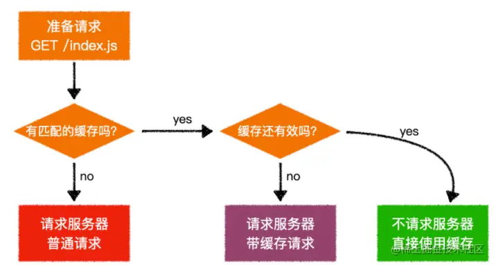

# 面经

1. 介绍一下控制并发数队列的实现原理，为什么要设计这个

一些比较大型的应用，需要一次性发几十上百个请求的时候，建立的 TCP 连接很可能阻塞了其他的资源，因此加上这样一个并发控制，可以让资源得以调度，让页面不至于卡死
```
const taskControll = (list, max) => {
  const handle = () => {
    if (list.length) {
      const callback = list.shift();
      callback().then(() => {
        handle();
      });
    }
  };
  for (let i = 0; i < max; i++) handle();
};
```
2. 介绍一下 es6 新增了哪些数据类型

Symbol、BigInt
3. 介绍 Symbol 的作用，以及有哪些用途

Symbol 是一种在ES6 中新添加的数据类型，本质上是一种唯一标识符，可用作对象的唯一属性名，Symbol类型的key是不能通过Object.keys()或者for...in来枚举的它未被包含在对象自身的属性名集合(property names)之中。所以，利用该特性，我们可以把一些不需要对外操作和访问的属性使用Symbol来定义。也正因为这样一个特性，当使用JSON.stringify()将对象转换成JSON字符串的时候，Symbol属性也会被排除在输出内容之外

4. 你开发中有用到过 Symbol 吗？简单介绍一下

同上一题
5. 介绍浏览器的 EventLoop 的整个过程
6. 知道有哪些宏任务与微任务吗？


7. 来介绍网络七层模型有哪些？


应用层 文件传输，电子邮件，文件服务，虚拟终端 TFTP，HTTP，SNMP，FTP，SMTP，DNS，Telnet

表示层 数据格式化，代码转换，数据加密 没有协议

会话层 解除或建立与别的接点的联系 没有协议

传输层 提供端对端的接口 TCP，UDP

网络层 为数据包选择路由 IP，ICMP，RIP，OSPF，BGP，IGMP

数据链路层 传输有地址的帧以及错误检测功能 SLIP，CSLIP，PPP，ARP，RARP，MTU

物理层 以二进制数据形式在物理媒体上传输数据 ISO2110，IEEE802，IEEE802.2
8. 跨域是什么

浏览器出于安全考虑，会有同源策略，即同协议、同域名、同端口
9.  跨域的解决方法有哪些

- JSONP
- CORS （跨资源共享）设置响应头Access-Control-Allow-Origin
- 设置代理
10. 介绍一下 jsonp 的原理

script标签不受浏览器同源策略的影响，可以通过src属性，请求非同源的接口，缺点是：只支持GET数据请求，不支持POET数据请求
11. CORS 解决跨域一般会设置哪几个请求头，并说说这些请求体的作用

Origin：声明源
预检请求：与简单请求不同，“需预检的请求”要求必须首先使用 OPTIONS 方法发起一个预检请求到服务器，以获知服务器是否允许该实际请求。"预检请求“的使用，可以避免跨域请求对服务器的用户数据产生未预期的影响
> OPTIONS /doc HTTP/1.1
> Host: bar.other
> User-Agent: Mozilla/5.0 (Macintosh; Intel Mac OS X 10.14; rv:71.0) Gecko/20100101 Firefox/71.0
> Accept: text/html,application/xhtml+xml,application/xml;q=0.9,*/*;q=0.8
> Accept-Language: en-us,en;q=0.5
> Accept-Encoding: gzip,deflate
> Connection: keep-alive
> Origin: https://foo.example
> Access-Control-Request-Method: POST
> Access-Control-Request-Headers: X-PINGOTHER, Content-Type

> HTTP/1.1 204 No Content
> Date: Mon, 01 Dec 2008 01:15:39 GMT
> Server: Apache/2
> Access-Control-Allow-Origin: https://foo.example
> Access-Control-Allow-Methods: POST, GET, OPTIONS
> Access-Control-Allow-Headers: X-PINGOTHER, Content-Type
> Access-Control-Max-Age: 86400
> Vary: Accept-Encoding, Origin
> Keep-Alive: timeout=2, max=100
> Connection: Keep-Alive

> POST /doc HTTP/1.1
> Host: bar.other
> User-Agent: Mozilla/5.0 (Macintosh; Intel Mac OS X 10.14; rv:71.0) Gecko/20100101 Firefox/71.0
> Accept: text/html,application/xhtml+xml,application/xml;q=0.9,*/*;q=0.8
> Accept-Language: en-us,en;q=0.5
> Accept-Encoding: gzip,deflate
> Connection: keep-alive
> X-PINGOTHER: pingpong
> Content-Type: text/xml; charset=UTF-8
> Referer: https://foo.example/examples/preflightInvocation.html
> Content-Length: 55
> Origin: https://foo.example
> Pragma: no-cache
> Cache-Control: no-cache

> HTTP/1.1 200 OK
> Date: Mon, 01 Dec 2008 01:15:40 GMT
> Server: Apache/2
> Access-Control-Allow-Origin: https://foo.example
> Vary: Accept-Encoding, Origin
> Content-Encoding: gzip
> Content-Length: 235
> Keep-Alive: timeout=2, max=99
> Connection: Keep-Alive
> Content-Type: text/plain

12. 如果设置 access-control-allow-origin: * 会有什么问题吗？

> **安全性问题**： 允许任何域的网站访问你的资源可能会引发安全风险，特别是当资源包含敏感信息时。攻击者可以利用这种设置来访问敏感数据或执行恶意操作。
> **信息泄露**： 如果你的网站允许任何域的请求，那么攻击者可以通过在恶意网站上执行JavaScript来获取你网站上的信息，甚至可能盗取用户的个人信息。
> **CSRF（跨站请求伪造）攻击**： 攻击者可以通过伪造请求来执行潜在的恶意操作，因为他们可以发送跨域请求到你的服务器，服务器会接受这些请求并执行操作。
> **信任问题**： 允许任何域的请求可能会降低用户对你的网站的信任，因为他们无法确定访问他们数据的是谁。
13. 用过哪些包管理器
14. 知道 npm 与 yarn 的有什么不同吗
性能： yarn在性能方面通常比npm更快。yarn使用并行下载和缓存机制，能够更快地下载和安装依赖包，特别是在较大的项目中。
缓存机制： yarn使用了一个全局缓存来存储下载过的依赖，这使得多个项目可以共享同一个缓存，从而减少了重复下载的情况。npm 5及以后的版本也引入了类似的本地缓存机制。
版本解析： yarn使用yarn.lock文件来确保依赖的版本一致性，而npm使用package-lock.json。yarn的锁定机制在依赖版本解析上更严格一些，可以避免不同开发环境下的不一致性。
15. yarn 当初设计出来是为了解决 npm 的哪些问题？
- 性能问题
- 版本一致问题
- npm早期的安全问题
16. 那目前还存在哪些问题？
17. 使用过 pnpm 吗？为什么使用它，它解决了什么问题？
18. 说一说 vue3 与 vue2 的区别？

Vue 2： Vue 2使用了基于Object.defineProperty的响应性系统，这个系统有一些限制，比如无法直接监听数组的变化，需要使用特定的方法来操作数组。
Vue 3： Vue 3引入了一个全新的响应性系统，基于Proxy对象。这个系统更加强大和灵活，可以更好地处理对象和数组的变化
19. 介绍一下 vue2 与 vue3 响应式原理的不同

Vue 2 响应式原理
在Vue 2中，响应式系统是基于Object.defineProperty实现的，这个系统允许Vue追踪数据的变化并更新界面。当一个对象被传入Vue实例的数据选项中时，Vue会递归地将对象的每个属性转换为响应式属性，通过getter和setter来实现。
Getter 和 Setter： Vue 2会在对象的属性上使用getter和setter。当获取属性值时，会记录依赖关系，当属性值改变时，会通知相关的依赖进行更新。
递归转换： Vue 2会递归地将对象的所有属性转换为响应式属性，这意味着对象一旦被添加到Vue实例的数据选项中，它的属性就会变成响应式的。
数组特殊处理： 对于数组，Vue 2会重写数组的一些原型方法，使得这些方法能够触发界面更新，从而实现数组的响应式。

Vue 3 响应式原理：
Vue 3在响应式方面进行了重大改进，使用了基于Proxy的新响应式系统。这个系统更加强大和灵活，同时也解决了Vue 2中一些限制。
Proxy 对象： Vue 3使用Proxy对象来实现响应式。通过Proxy，可以在访问和修改属性时进行拦截，实现更细粒度的响应式控制。
深层代理： Vue 3的响应式系统可以深层代理对象的属性，包括嵌套对象的属性。这样就不需要像Vue 2那样递归地转换对象的每个属性。
Map 和 Set： Vue 3的响应式系统也支持Map和Set等数据结构，这是Vue 2中所不具备的。
数组特殊处理： 在Vue 3中，数组的处理更加一致和可预测。通过Proxy，数组的所有操作都可以被拦截，从而实现数组的响应式
20. 写了一道简单的斐波那契数列，然后分析一下空间复杂度与时间复杂度
21. 看你做过表格的封装，介绍一下？
22. 如何解决长列表问题？
23. 介绍一下虚拟滚动的原理

滚动事件本身不会造成太多的性能消耗，而是因为滚动事件伴随有大量的元素参与进来一起进行回流的操作才会影响浏览器的性能
虚拟滚动其实就是综合数据分页和无限滚动的方法，在有限的视口中只渲染我们所能看到的数据，超出视口之外的数据就不进行渲染，可以通过计算可视范围内的但单元格，保证每一次滚动渲染的DOM元素都是可以控制的，不会担心像数据分页一样一次性渲染过多，也不会发生像无限滚动方案那样会存在数据堆积，是一种很好的解决办法。

24. 你会对高频事件有什么优化吗？

利用防抖和节流，减少高频事件的触发
25. 介绍一下防抖和节流

防抖：连续点击的情况下不会执行，只在最后一下点击过指定的秒数后才会执行
应用场景：点击按钮，输入框模糊查询，词语联想等

节流：频繁触发的时候，比如滚动或连续点击，在指定的间隔时间内，只会执行一次
应用场景：resize、scroll等
26. 写一个简单的节流函数

```
    const btn = document.getElementById("btn");

    function debounce() {
      console.log(1);
      let timeout = null; //此处的timeout用了闭包的特性
      return () => {
        // 每一次点击判断有延迟执行的任务就停止
        if (timeout !== null) clearTimeout(timeout);
        // 否则就开启延迟任务
        timeout = setTimeout(() => {
          console.log("防抖");
        }, 1000);
      };
    }

    btn.addEventListener("click", debounce());
```

```
    const btn = document.getElementById("btn");
    const throttle = (fn, wait, ...arg) => {
      let date = Date.now();
      return function () {
        let now = Date.now();
        if (now - date > wait) {
          fn.apply(this, arg);
          date = now;
        }
      };
    };
    const f = (name) => {
      console.log(name, "节流成功");
    };

    btn.addEventListener("click", throttle(f, 1000, '张三'));
```


27. js模块化
常见的模块化有commonjs、AMD、CMD、es6 module四种规范
> commonjs,是nodejs中默认采用的模块化规范，也就是我们常见的require('**')那种,引用其他模块的方式是require，后面的参数可以是第三方模块的名称（保证此时第三方模块已经安装在你的node_modules中），也可以是模块文件的地址，返回值是一个对象，在浏览器中使用时需要browserify包将模块打包成浏览器支持的模式。 输出值拷贝而非地址的加载机制(AMD、CMD规范均采用的是这种方式，而es6 module输出为引用)
```
const axios = require("axios");// 引用axios包导出的对象
const subModule = require("./modules/subModule.js");// 引用./modules/subModule.js文件中导出的对象
```
> 导出的方式有两种，一种是使用module.exports导出整个对象,一种是是使用exports单独导出每一个key:
```
//./modules/subModule.js文件
let obj = {a: 1, b: 2}
module.exports = obj

//./modules/subModule.js文件
let obj = {a: 1, b: 2}
module.exports = obj
```

**AMD**
> 在commonjs中，模块是同步加载的（毕竟它是设计给服务端nodejs的），也就是说，即使不需要依赖其他模块的代码，依然需要等待前面模块加载完毕之后才能开始执行，在模块越来越大之后无疑会损失更多性能，因此AMD（Asynchronous Module Definition 异步模块定义）便应运而生，AMD的用法如下
```
//nodejs默认采用的是cjs规范，因此不能直接使用AMD模块化的方式，需要借助第三方库，常用的支持AMD模块化的库是requirejs
npm i requirejs --save
```
```
// index.js
var requirejs = require('requirejs');

requirejs.config({
  paths: {
    libAMD: 'module/index',
    subModule: 'module/index2'
  }
})

requirejs(["libAMD"], function(libAMD) {
  console.log(libAMD.count)
  libAMD.countPlus()
  console.log(libAMD.count)

  console.log(libAMD.submodule.name)
})
```

```
// module/index.js
define(["subModule"], function(submodule) {     //这里导入了subModule模块
  let count = 0;

  function countPlus() {
    count += 1;
  }

  return {count, countPlus, submodule};
})

```

```
// module/index2.js
define([], function() {
  return {name: 'I’m a sub module'}
})
```
执行结果：


> 在浏览器端使用AMD的方式也比较简单，只要在主函数执行前加载requirejs库即可，引用和导出方式与在服务端使用AMD规范基本相同。


**CMD**
> CMD的基本逻辑跟AMD是一致的，只不过在写法上CMD采用了cjs的部分语法，且CMD仅支持浏览器端使用，并在模块加载方面针对浏览器端运行的代码做了些许优化。同样需要引入三方库来支持CMD规范，比较常用的是sea.js
```
<script src="https://cdn.bootcdn.net/ajax/libs/seajs/3.0.3/sea.js"></script>
<script>
  seajs.config({
    base: './module/',
    alias: {
      libAMD: 'index.js',
      subModule: 'index2.js'
    }
  })

  seajs.use('./main.js')
</script>
```
```
// main.js
define(function(require) {
  let libAMD = require("libAMD")

  console.log(libAMD.count)
  libAMD.countPlus()
  console.log(libAMD.count)

  console.log(libAMD.submodule.name)
})

```
```
// module/index.js
define(function(require, exports, module) {
  let count = 0;

  function countPlus() {
    count += 1;
  }

  let submodule = require("subModule");

  module.exports = {count, countPlus, submodule};
})

```
```
define(function(require, exports, module) {
  exports.name = 'I’m a sub module'
})
```
模块导出则可以在回调函数中获得exports和module对象，依然按照cjs的方法进行使用。


28. 是否了解typeof？

对未定义的变量使用typeof检测也会返回一个“undefined”。不会报错。但在加入了块级作用域的 let 和 const 之后，在其被声明之前对块中的 let 和 const 变量使用 typeof 会抛出一个 ReferenceError。块作用域变量在块的头部处于“暂存死区”，直至其被初始化，在这期间，访问变量将会引发错误。

暂时性死区：在解析代码时，JavaScript 引擎也会注意出现在块后面的 let 声明，只不过在此之前不能以任何方式来引用未声明的变量。在 let 声明之前的执行瞬间被称为“暂时性死区”。简单来说就是在使用let、const声明变量之前访问这个变量就会报错。
```
typeof undeclaredVariable === 'undefined'; // 不会抛出错误
typeof newLetVariable; // ReferenceError
typeof newConstVariable; // ReferenceError
typeof newClass; // ReferenceError

let newLetVariable;
const newConstVariable = 'hello';
class newClass{};
```
**为什么 typeof null === 'object';？**
这里其实是一个JavaScript历史遗留问题，需要从JavaScript底层是如何存储数据的类型信息讲起。

在 JS 的最初版本中使用的是 32 位系统，为了性能考虑使用低位存储变量的类型信息，000 开头代表是对象然而 null 表示为全零，所以将它错误的判断为 object
typeof原理： 不同的对象在底层都表示为二进制，在Javascript中二进制前（低）三位存储其类型信息。
000: 对象 010: 浮点数 100：字符串 110： 布尔 1： 整数
null：所有机器码均为0

29. 所有基本类型的值都是不可改变的。

```
var bar = "baz";
bar[0] = "a";
console.log(bar[0]);  //b
console.log(bar);     //baz
```
> 所有基本类型的值都是不可改变的，这里变量bar指向了"bar"字符串，通过bar[0]赋值并不会修改基础数据类型


30. 除了typeof 还有其它获取具体类型的方法吗
- instanceof instanceof 运算符用于检测构造函数的 prototype 属性是否出现在某个实例对象的原型链上。即检测对象A是否为对象B的实例。但是判断不了A具体是什么数据类型，B要求是对象类型。instanceof能够检查object、date、array、function等引用类型，但是检查不了number、boolean、string 等基本数据类型。
- constructor(不推荐) constructor 在其对应对象的原型下面，是自动生成的。当我们写一个构造函数的时候，程序会自动添加：构造函数名.prototype.constructor = 构造函数名，constructor属性是可以被修改的，会导致检测出的结果不正确。
- Object.prototype.toString.call()（推荐）Object上有两个toString方法，一个在Object本身，另一个在Object.prototype原型对象上。Object.prototype上的toString()方法具有判断数据类型的功能。默认情况下，toString() 方法被每个 Object 对象继承。如果此方法在自定义对象中未被覆盖，toString() 返回 “[object type]”，其中 type 是对象的类型。也就是说，Object本身上的toString()方法是继承了原型上的方法后进行了重写。Array，function等类型作为Object的实例，都重写了toString()方法，调用的时候直接调用重写的toString()方法。

31. 实现bind方法
```
Function.prototype.bind = function () {
  var _this = this;
  var context = arguments[0];
  var arg = [].slice.call(arguments, 1);
  return function () {
    arg = [].concat.apply(arg, arguments);
    _this.apply(context, arg);
  };
};

const test = (s1, s2) => {
  console.log(s1, s2);
};

test.bind(null, "张三", "李四")();
```
bind有个特性，bind方法可以分多次传参，最后函数运行时会把所有参数连接起来一起放入函数运行。

32. 了解事件委托机制吗？捕获和冒泡阶段
就是把目标节点的事件绑定到祖先节点上。这种简单而优雅的事件注册方式是基于事件传播过程中，逐层冒泡总能被祖先节点捕获。
为什么要用事件委托：
- 节省监听数，节省内存
- 可以监听动态元素，对于js动态生成的元素只能通过事件委托来监听

33. target和currTarget区别
target 是对触发事件的对象的引用
currentTarget 当事件遍历DOM时，标识事件的当前目标。它总是引用事件处理程序附加到的元素（事件绑定的元素，不一定是那个真实DOM,因为会冒泡）
简单例子
```
<div id="a">
  <div id="b">
    <div id="c">
      <div id="d">哈哈哈哈哈</div>
    </div>
  </div>
</div>

const a = document.getElementById('a')
const b = document.getElementById('b')
const c = document.getElementById('c')
const d = document.getElementById('d')
a.addEventListener('click', (e) => {
  const {
    target,
    currentTarget
  } = e
  console.log(`target是${target.id}`)
  console.log(`currentTarget是${currentTarget.id}`)
})
b.addEventListener('click', (e) => {
  const {
    target,
    currentTarget
  } = e
  console.log(`target是${target.id}`)
  console.log(`currentTarget是${currentTarget.id}`)
})
c.addEventListener('click', (e) => {
  const {
    target,
    currentTarget
  } = e
  console.log(`target是${target.id}`)
  console.log(`currentTarget是${currentTarget.id}`)
})
d.addEventListener('click', (e) => {
  const {
    target,
    currentTarget
  } = e
  console.log(`target是${target.id}`)
  console.log(`currentTarget是${currentTarget.id}`)
})

```

输出结果
target是d currentTarget是d
target是d currentTarget是c
target是d currentTarget是b
target是d currentTarget是a

34. 了解进程和线程吗？说说你对进程和线程的了解

一个程序必定包含>=1个进程，
一个进程必定包含>=1个线程，
进程之间不共享内存，每多一个进程就要多分配一定的内存。
多个线程共享内存，因此多线程可以提高程序的并发性。

JS单线程带来的好处：

JS主要是面向浏览器的，因此是和用户实时交互的，如果多线程执行的话，你无法确定同时开始的任务哪个会先结束，以网页加载为例，可能导致网页HTML结构已经加载好，但是CSS样式还未加载完成，导致用户浏览体验差。或者两个线程同时对一个DOM结点进行修改和删除操作，则无法判断以哪个线程为准。
为了利用多核 CPU 的计算能力，HTML5 提出 Web Worker 标准，允许 JavaScript 脚本创建多个线程，但是子线程完全受主线程控制，且不得操作 DOM。所以，这个新标准并没有改变 JavaScript 单线程的本质。

但是浏览器是多进程的，简单理解是打开一个tab页相当于创立一个独立的浏览器进程，同时还包括Browser进程（也叫控制进程），第三方插件进程，GPU进程，浏览器渲染进程
**渲染进程**
> 浏览器的渲染进程是多线程的。

渲染进程的主要常驻线程:
- GUI渲染线程
  - 负责渲染浏览器界面，解析HTML，CSS，构建DOM树和RenderObject树，布局和绘制等
  - 当界面需要重绘（Repaint）或由于某种操作引发回流(reflow)时，该线程就会执行
- JS引擎线程（JS内核）
  - 负责处理Javascript脚本程序（例如V8引擎）
  - JS引擎一直等待着任务队列中任务的到来，然后加以处理，一个Tab页（renderer进程）中无论什么时候都只有一个JS线程在运行JS程序
- 事件触发线程（解释了事件循环）
  - 归属于浏览器而不是JS引擎，用来控制事件循环（可以理解，JS引擎自己都忙不过来，需要浏览器另开线程协助）
  - 当JS引擎执行代码块如setTimeOut时（或是来自浏览器内核的其他线程，如鼠标点击、AJAX异步请求等），会将对应任务添加到事件线程中
  - 当对应的事件符合触发条件被触发时，该线程会把事件添加到待处理队列的队尾，等待JS引擎的处理
  - 注意，由于JS的单线程关系，所以这些待处理队列中的事件都得排队等待JS引擎处理（当JS引擎空闲时才会去执行）
- 定时触发器线程
  - 传说中的setInterval与setTimeout所在线程；
  - 浏览器定时计数器并不是由JavaScript引擎计数的（因为JavaScript引擎是单线程的，如果处于阻塞线程状态就会影响记计时的准确）
  - 因此通过单独线程来计时并触发定时（计时完毕后，添加到事件队列中，等待JS引擎空闲后执行）
- 异步http请求线程
  - XMLHttpRequest在连接后是通过浏览器新开一个线程请求
  - 
> 注意，GUI渲染线程与JS引擎线程是互斥的，当JS引擎执行时GUI线程会被挂起（即js的解析会阻止dom元素的渲染），GUI更新会被保存在一个队列中等到JS引擎空闲时立即被执行。所以如果JS执行的时间过长，这样就会造成页面的渲染不连贯，导致页面渲染加载阻塞。


35. 浏览器渲染流程
> 简化理解，前期准备工作略掉，浏览器输入url，浏览器主进程接管，开一个下载线程，然后进行http请求（略去DNS查询，IP寻址等等操作），然后等待响应，获取内容，随后将内容通过RendererHost接口转交给Renderer进程，浏览器渲染流程开始。

**渲染大概分为以下几个步骤**
- 解析html建立dom树；
- 解析css构建render树（将CSS代码解析成树形的数据结构，然后结合DOM合并成render树）；
- 布局render树（Layout/reflow），负责各元素尺寸、位置的计算；
- 绘制render树（paint），绘制页面像素信息；


渲染完毕后就是load事件了，之后就是自己的JS逻辑处理了。
**1.load事件与DOMContentLoaded事件的先后**
上面提到，渲染完毕后会触发load事件，那么你能分清楚load事件与DOMContentLoaded事件的先后么？
当 DOMContentLoaded 事件触发时，仅当DOM加载完成，不包括样式表，图片。(譬如如果有async加载的脚本就不一定完成)
当 onload 事件触发时，页面上所有的DOM，样式表，脚本，图片都已经加载完成了。（渲染完毕了）
所以，顺序是：DOMContentLoaded => load

**2.css加载是否会阻塞dom树渲染？**
> css是由单独的下载线程异步下载的,所以css加载不会阻塞DOM树解析（异步加载时DOM照常构建），但会阻塞render树渲染（渲染时需等css加载完毕，因为render树需要css信息）这可能也是浏览器的一种优化机制。
因为你加载css的时候，可能会修改下面DOM节点的样式，如果css加载不阻塞render树渲染的话，那么当css加载完之后，render树可能又得重新重绘或者回流了，这就造成了一些没有必要的损耗。
所以干脆就先把DOM树的结构先解析完，把可以做的工作做完，然后等你css加载完之后，在根据最终的样式来渲染render树，这种做法性能方面确实会比较好一点。

**从Event Loop谈JS的运行机制**
JavaScript是单线程，怎样执行异步的代码 ？

单线程就意味着，所有任务需要排队，前一个任务结束，才会执行后一个任务。如果前一个任务耗时很长，后一个任务就不得不一直等着。
js 引擎执行异步代码之所以不用等待，是因有为有消息队列和事件循环。
> 消息队列：消息队列（也叫任务队列）是一个先进先出的队列，它里面存放着各种消息（任务）
> 事件循环：事件循环是指主线程重复从消息队列中取消息、执行的过程。
实际上，主线程只会做一件事情，就是从消息队列里面取消息、执行消息，再取消息、再执行。当消息队列为空时，就会等待直到消息队列变成非空。而且主线程只有在将当前的消息执行完成后，才会去取下一个消息。这种机制就叫做事件循环机制，取一个消息并执行的过程叫做一次循环。
> 消息就是注册异步任务时添加的回调函数。
> 消息队列中又会细分微任务、宏任务


36. 定时器
在调用setTimeout后，是如何等待特定时间后才添加到事件队列中的？
它是由定时器线程控制（因为JS引擎自己都忙不过来，根本无暇分身）
为什么要有单独的定时器线程？因为JavaScript引擎是单线程的，如果处于阻塞线程状态就会影响记计时的准确，因此很有必要单独开一个线程用来计时。
当使用setTimeout或setInterval时，它需要定时器线程计时，计时完成后就会将特定的事件推入事件队列中。

37. 手写发布订阅模式
```
class EventBus {
  constructor() {
    this.list = {};
  }

  on(event, cb) {
    if (this.list[event] === undefined) {
      this.list[event] = [];
    }
    this.list[event].push(cb);
  }

  emit(event, ...args) {
    if (this.list[event]) {
      this.list[event].forEach((item) => {
        item(...args);
      });
    }
  }

  off(event, cb) {
    if (this.list[event]) {
      for (let i = 0; i < this.list[event].length; i++) {
        if (cb === this.list[event][i]) {
          this.list[event].splice(i, 1);
          return;
        }
      }
    }
  }
}

const event = new EventBus();
//累加求和
const add = (...args) => console.log(args[0] + args[1]);
//打印参数
const log = (...args) => console.log(...args);

event.on("add", add);
event.on("log", log);
event.emit("add", 1, 2); // 3
event.emit("log", "hi"); // hi
event.off("add", add);
```

38. 尾递归

```
//斐波拉契数列
//传统递归写法
const fibonacci = (n) => {
  if (n === 0 || n === 1) return n;
  else return fibonacci(n - 2) + fibonacci(n - 1);
};

//尾递归优化
const tailFibonacci = (n, n1, n2) => {
  if (n === 0) return n1;
  else return tailFibonacci(n - 1, n2, n1 + n2);
};

console.log(fibonacci(5), tailFibonacci(5, 0, 1));

//n的阶乘
//传统写法
const factorial = (n) => {
  if (n === 1) return 1;
  else return factorial(n - 1) + n;
};

const tailFactorial = (n, sum) => {
  if (n === 0) return sum;
  else return tailFactorial(n - 1, sum + n);
};

console.log(factorial(5), tailFactorial(5, 0));

```

39. 观察者模式和发布订阅模式区别
观察者模式由至少两个对象组成，观察者和被观察者，通过被观察者建立联系，一个被观察者可以被多个观察者观测，被观察者将观察者加入列表中，当触发相应事件时通知观察者执行相应发放
发布订阅模式至少由三个对象组成，发布者、订阅者、事件中心，订阅者通过事件中心订阅，发布者通过事件中心发布消息，在一定程度上起到了解耦的作用

40. json序列化

**json在js中支持的三种类型**
- 简单值：字符串、数值、bool、null可以在JSON中出现，undefined不可以，symbol不可以
- 数组
- 对象

**json不能将undefined和symbol序列化，是json方法深拷贝的缺陷**
json序列化规则
- 对于JavaScript中的六种原始类型，JSON语法支持数字、字符串、布尔值、null四种，不支持undefined，Symbol
- NaN、Infinity和-Infinity序列化的结果是null
- JSON语法不支持函数
- 对于Set，Map，RegExp、Error对象，JSON语法无法保证序列化安全
- 日期对象序列化的结果是ISO格式的字符串（调用了Date对象的toJSON方法），但JSON.parse()依然保留它们字符串形态，并不会将其还原为日期对象
- JSON.stringify()只能序列化对象的可枚举的自有属性

41. get 属性可以被序列化出来吗

可以，对于普通的 JavaScript 对象而言，它的属性默认都是可枚举的，因此在被序列化时，其所有属性都会被包含在序列化后的字符串中。而 get 关键字定义的操作符只是属性访问器的一种方式，本质上仍然是一个属性，因此也是可枚举的，可以被序列化出来。**get属性也是可枚举的**

42. JavaScript对象中的可枚举属性和不可枚举属性
在JavaScript中，对象的属性有可枚举和不可枚举之分它是由对象属性描述符enumerable决定的。如果该属性是可枚举性的那么这个属性就能被for…in查找遍历到。在JavaScript中可以通过Object.defineProperty()来为对象设置属性描述符。

43. 把一张图片序列化到json里面，有什么方式
- 使用Base64编码
- 使用URL引用

44. 如何通过原型修改第三方类库，来实现自己的功能而不破坏类库？手写一下
```
//原始的第三方库
function Person(name, age) {
    this.name = name;
    this.age = age;
}

Person.prototype.sayHello = function() {
    console.log("Hello, I am " + this.name);
};

//使用原型链来增加新的方法
Person.prototype.introduce = function() {
    this.sayHello();
    console.log("I am " + this.age + " years old.");
};

// 测试
var tom = new Person("Tom", 25);
tom.introduce(); // 输出：Hello, I am Tom \n I am 25 years old.
```
**不要随意改变或覆盖第三方库中已经存在的方法**

45. 并发和并行
并发是指一个处理器同时处理多个任务。
并行是指多个处理器或者是多核的处理器同时处理多个不同的任务。
并发是逻辑上的同时发生（simultaneous），而并行是物理上的同时发生。
来个比喻：并发是一个人同时吃三个馒头，而并行是三个人同时吃三个馒头。

46. 浏览器垃圾回收机制
**V8回收策略**
分代回收策略 将内存分成新生代和老生代 对新老生代采取不同的回收策略

新生代内存回收
系统会给新生代分配一片内存空间，将这块空间分为from、to两部分，from是正在使用的空间，to是空闲的空间，当浏览器开始进行垃圾回收时，会检查from空间，如果不是存活的对象，会直接回收，存活的对象会复制到右边的to空间；等再有新生代的对象产生时，form、to左右对调、这样做的好处是处理一些零散的内存碎片


图中橙色的块代表存活对象，白色地方代表未分配的内存。正常情况下，由于堆内存是连续分配的，但是也有可能出现上图的这种内存分配情况，这种零散的分配情况就造成了内存碎片，会影响比较大的内存对象的放置。

进行这样的算法处理，明显会让内存排布变得更整齐了，这样就非常方便之后新来的对象的内存分配。

老生代内存回收
那么新生代中的变量如果经过回收之后依然一直存在，那么就会被放入到老生代内存中。时间长了之后通过几个原因的判断，我们就会把这些变量进行 "晋升"

那么老生代内存中的垃圾回收，是采用什么样的策略进行的呢？这里采用了 Mark-Sweep（标记清除） 和 Mark-Compact（标记整理）的策略
**标记清除**
首先它会遍历堆上的所有的对象，分别对它们打上标记；然后在代码执行过程结束之后，对使用过的变量取消标记。那么没取消标记的就是没有使用过的变量，因此在清除阶段，就会把还有标记的进行整体清除，从而释放内存空间。但是其实通过标记清除之后，还是会出现上面图中的内存碎片的问题。因此就需要使用到标记整理策略（Mark-Compact）
**标记整理**
为了方便解决浏览器中的内存碎片问题，标记整理这个策略被提出。这个策略是在标记清除的基础上演进而来的，和标记清除来对比来看，标记整理添加了活动对象整理阶段，处理过程中会将所有的活动对象往一端靠拢，整体移动完成后，直接清理掉边界外的内存。其操作效果如下图所示。


47. 浏览器缓存策略
- 域名解析，DNS缓存
- 本地缓存（memory缓存）
- Http缓存（强缓存和协商缓存）
- 服务端缓存（cdn缓存）

dns解析会对网络请求带来一定损耗所以浏览器在第一次获取到IP地址后，会将其缓存起来。下次相同域名再次发起请求时，浏览器会先查找本地缓存，如果缓存有效，则会直接返回该IP地址，否则会继续开始寻址之旅。
- 首先搜索浏览器自身的DNS缓存,如果存在，则域名解析到此完成。
- 如果浏览器自身的缓存里面没有找到对应的条目，那么会尝试读取操作系统的hosts文件看是否存在对应的映射关系,如果存在，则域名解析到此完成。
- 如果本地hosts文件不存在映射关系，则查找本地DNS服务器(ISP服务器,或者自己手动设置的DNS服务器),如果存在,域名到此解析完成
- 如果本地DNS服务器还没找到的话,它就会向根服务器发出请求,进行迭代查询。

memory cache（本地缓存）
memory cache 是浏览器为了加快读取缓存速度而进行的自身的优化行为，不受开发者控制，也不受 HTTP 协议头的约束。当资源被存入内存后，下次同样的请求将不再通过网络，而是直接访问内存，当关闭该页面时，此资源就被内存释放掉了，再次重新打开相同页面时不再出现from memory cache的情况。
那什么时候资源会被放入memory缓存呢？
答案是几乎所有的网络请求资源都会根据相关的策略被浏览器自动加入到 memory cache 中。但是也正因为数量很大但是浏览器占用的内存不能无限扩大这样两个因素，memory cache 注定只能是个“短期存储”。当数据量过大，即使网页不关闭，缓存依然会失效。

disk cache（硬盘缓存）
硬盘缓存取决于HTTP中的响应头信息，它也是浏览器缓存中最重要的内容。
HTTP所控制下的 disk cache 缓存分为强制缓存和协商缓存
**强缓存**
对于强缓存，控制它的字段分别是：Expires和Cache-Control，其中Cache-Control优先级比Expires高。
当客户端发出一个请求到服务器，服务器希望你把资源缓存起来，于是在响应头中加入了这些内容
```
Cache-Control: max-age=3600 我希望你把这个资源缓存起来，缓存时间是3600秒（1小时）
Expires: Thu, 10 Nov 2020 08:45:11 GMT 到达指定时间过期
Date: Thu, 30 Apr 2020 12:39:56 GMT
Etag:W/"121-171ca289ebf"，(后面协商缓存内容)这个资源的编号是W/"121-171ca289ebf"
Last-Modified:Thu, 30 Apr 2020 08:16:31 GMT，(后面协商缓存内容)这个资源的上一次修改时间
```
Cache-Control和 Expires分别是HTTP/1.1 和 HTTP/1.0的内容，为了兼容 HTTP/1.0 和 HTTP/1.1，实际项目中两个字段我们都会设置。
浏览器收到这个响应之后就会做下面的事情
- 浏览器把这次请求得到的响应体缓存到本地文件中
- 浏览器标记这次请求的请求方法和请求路径
- 浏览器标记这次缓存的时间是3600秒
- 浏览器记录服务器的响应时间



判断缓存是否有效就是通过把max-age + Date，得到一个过期时间，看看这个过期时间是否大于当前时间，如果是，则表示缓存还没有过期，仍然有效，如果不是，则表示缓存失效。

**协商缓存**
一旦发现缓存无效，它并不会简单的把缓存删除，而是抱着一丝希望，想问问服务器，我这个缓存还能继续使用吗？
于是，浏览器向服务器发出了一个带缓存的请求
所谓带缓存的请求，无非就是加入了以下的请求头：
```
If-Modified-Since: Thu, 30 Apr 2020 08:16:31 GMT  亲，你曾经告诉我，这个资源的上一次修改时间是格林威治时间2020-04-30 08:16:31，请问这个资源在这个时间之后有发生变动吗？
If-None-Match: W/"121-171ca289ebf"  亲，你曾经告诉我，这个资源的编号是W/"121-171ca289ebf，请问这个资源的编号发生变动了吗？
```
之所以要发两个信息，是为了兼容不同的服务器，因为有些服务器只认If-Modified-Since，有些服务器只认If-None-Match，有些服务器两个都认,但是一般来说 If-None-Match 的优先级高于 If-Modified-Since
此时可能会产生两个结果
- 缓存失效，服务器再次给予一个正常的响应（响应码200 带响应体），同时可以附带上新的缓存指令，浏览器缓存新的内容
- 缓存有效，服务器返回304重定向，并且响应头带上新的缓存指令，浏览器作出相应缓存动作


48. cookie、localstorage、sessionStorage

| 特性           | Cookie                                                                             | localStorage                                   | sessionStorage                               |
| -------------- | ---------------------------------------------------------------------------------- | ---------------------------------------------- | -------------------------------------------- |
| 数据的生命期   | 一般由服务器生成，可设置失效时间。如果在浏览器端生成Cookie，默认是关闭浏览器后失效 | 除非被清除，否则永久保存                       | 仅在当前会话下有效，关闭页面或浏览器后被清除 |
| 存放数据大小   | 4KB左右                                                                            | 一般为5MB                                      | 同localstroage                               |
| 与服务器端通信 | 每次都会携带在HTTP头中，发送给服务端。但是使用cookie保存过多数据会带来性能问题     | 仅在客户端（即浏览器）中保存，不和服务器的通信 | 同localstroage                               |


49. get和post的区别

get常是用于获取资源，post常是对资源进行操作
安全性：post相比get更安全，get参数暴露在url中的
幂等性：GET是幂等的，而POST不是。（幂等性是指无论一个操作进行一次或多次，结果都是相同的。）
大小限制：POST请求的数据量基本上没有限制，可以发送大量数据。GET请求的数据长度受到URL长度的限制

50. TCP协议三次握手，四次挥手

**为什么需要三次握手**
- 当client发出的第一个连接请求报文段SYN并没有丢失，而是在某个网络节点长时间的滞留，以导致延误时间释放以后的某个时间才到达server。时间一过，这个报文段是已经失效的
- 但是server收到此失效的连接报文段后，就会以为是client再次发出了一个新的连接请求，于是就向client发出确认报文段ACK和SYN，同意建立连接。
- 加入不采取‘三次握手’，只要server发出确认，新的连接就建立了。由于现在client并没有发出建立连接的请求，因此不会理睬server的确认，也不会向server发送数据。但server却以为新的运输连接已经建立，并一直等待client发来数据。这样，server的很多资源就白白浪费掉了
- 采用‘三次握手’就可以防止上述现象发生。例如刚才那种情况，client不会向server的确认发出确认，server由于收不到确认，就知道client并没有要求建立连接。主要目的是防止server一直等待，浪费资源。

**为什么需要四次挥手**
- 第一次是TCP客户端发送一个FIN，用来关闭客户到服务器的数据传送
- 第二次是服务器收到这个FIN后，它发回一个ACK,确认序号为收到的序号+1，和SYN一样，一个FIN将占有一个序号
- 第三次是服务器关闭客户端的连接，发送一个FIN给客户端
- 第四次客户端发回ACK报文确认，并将确认序号设置为收到序号+1

为什么服务器在收到客户端的FIN后，不一起发送ACK和FIN呢？
原因是因为tcp是全双工模式，server接受到FIN时意味将没有数据再发来，但是还是可以继续发送数据。（server可能此刻正在发送数据，还没发送完）。所以只能先回复一个ACK报文，告诉client，你发的FIN报文我收到了。只有等server所有的报文都发送完了，server才发生FIN报文，因此不能一起发送，所以需要四步挥手。


